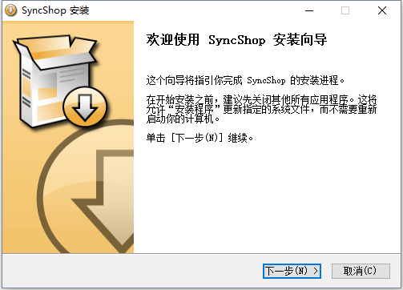
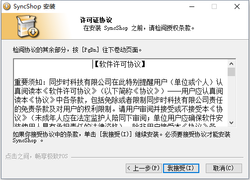
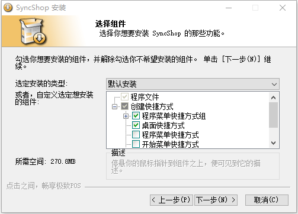
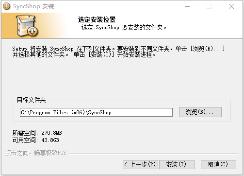
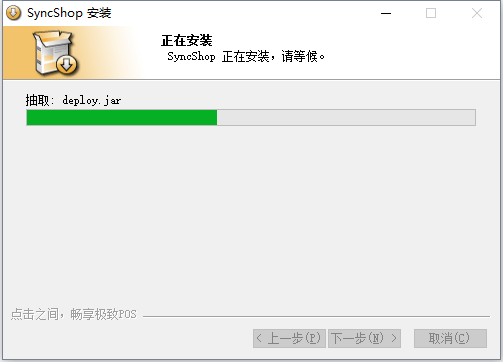
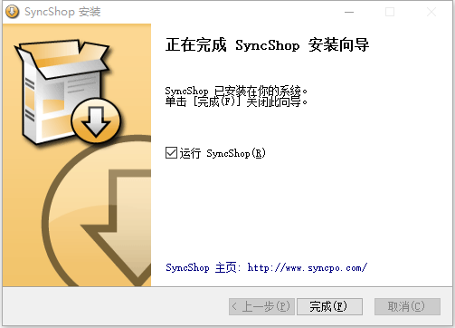

# 1、安装与激活

##安装程序

从官方网站（www.syncpo.com）下载程序，或者由客服人员提供；  安装包图示：；  

**双击安装程序**，即可进入安装过程；

  
点击**[下一步]**；

  
查看软件许可，点击**[我接受]**；  

  
可选择在创建多个快捷方式，一般情况下点击**[下一步]**即可；  

  
可选择程序安装路径，默认路径如图，下一步点击**[安装]**；  

      
请耐心等待，安装过程大约3~5分钟；  

  
恭喜您安装成功，点击**[完成]**；  

