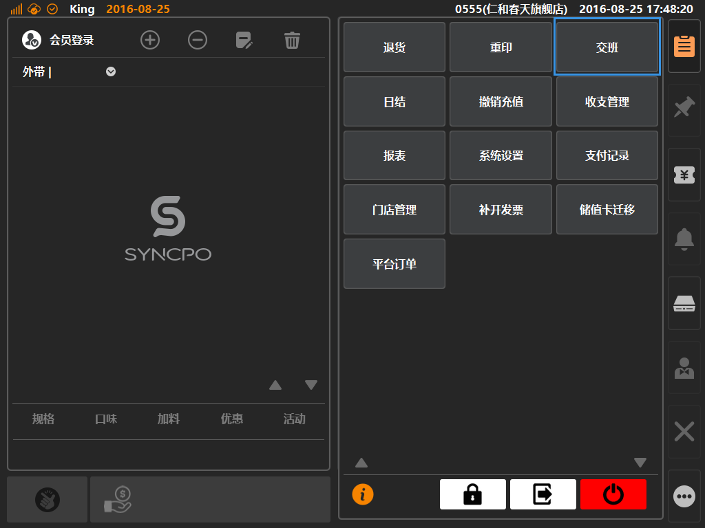
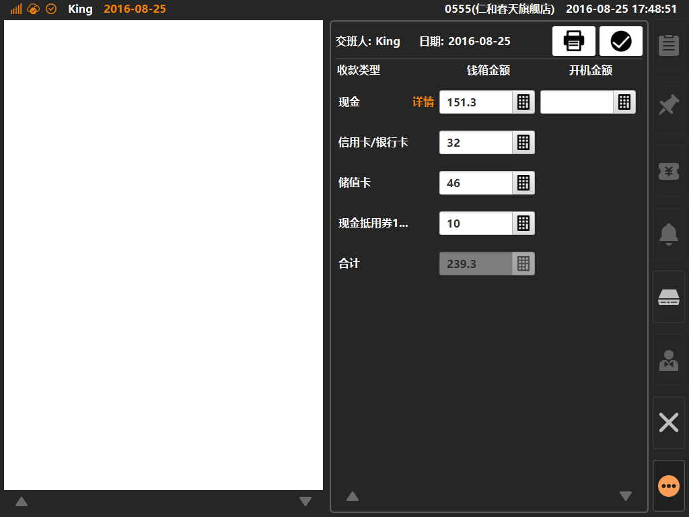
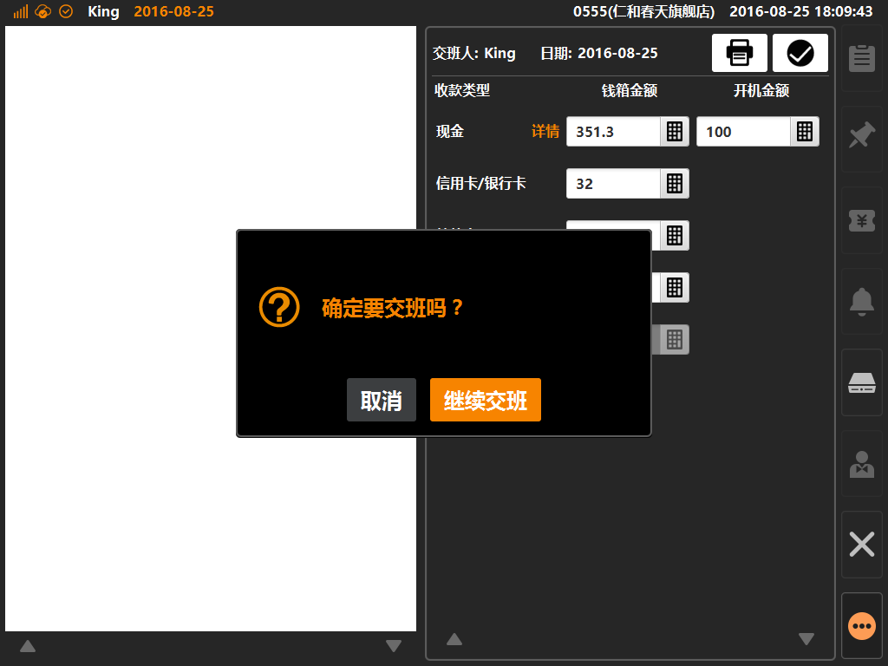
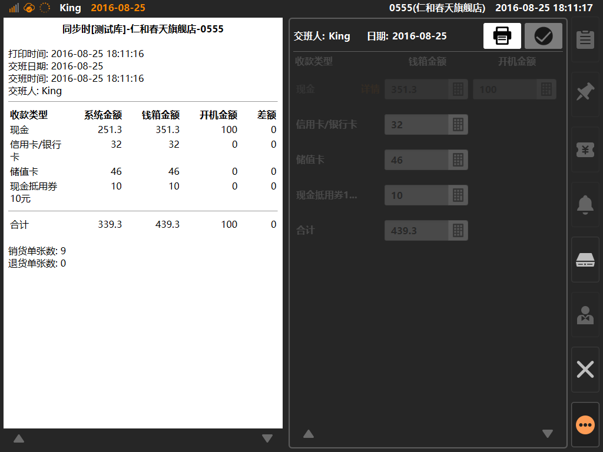

# 交班  
> 交班是什么：交班是一种门店运营管理方式，当两个班次的收银员进行换班交接时使用，将上一班次的收银数据进行统计并移交给下个班次的收银员；  

* ## 操作说明
* 1.点击主功能按键区的[更多功能]按键内的[交班]，将进入交班操作界面；  

  

* 2.进入交班界面，系统将统计当班的收支数据，并以明细的方式进行展示；  
* 现金拥有额外的明细项，包含：商品的现金收支、储值的现金收支、外卖平台到付的现金收支、收支管理的现金收支四种；  

  
  
 
* 3.收银员根据手动清点现金或者单据后，将实际金额填写入对应的栏位，点击右上角[确认]按键提交，将弹窗二次提示；
* 开机金额：等同备用金，经由每日营业起始时给出的找零准备金，非首班交班时等同上一班次移交的实际现金金额；  

  
  
  * 4.确认交班后，系统将自动生成报表，此时可手动点击右上角[打印]图标，进行交班票据打印；  
  
    
    
  * 5.