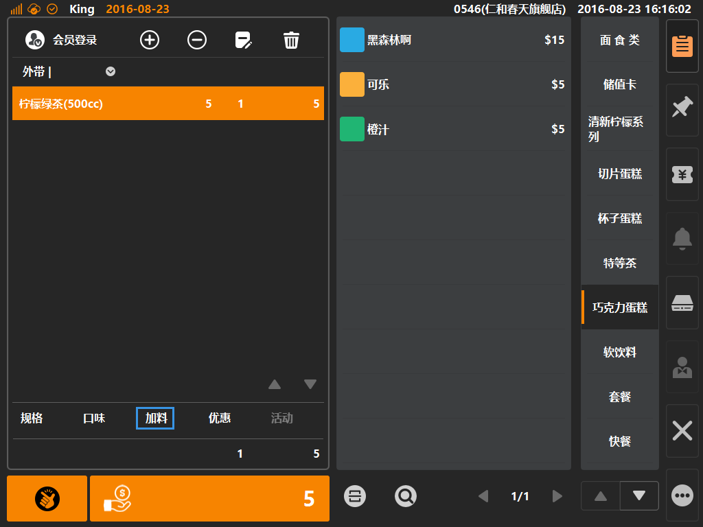
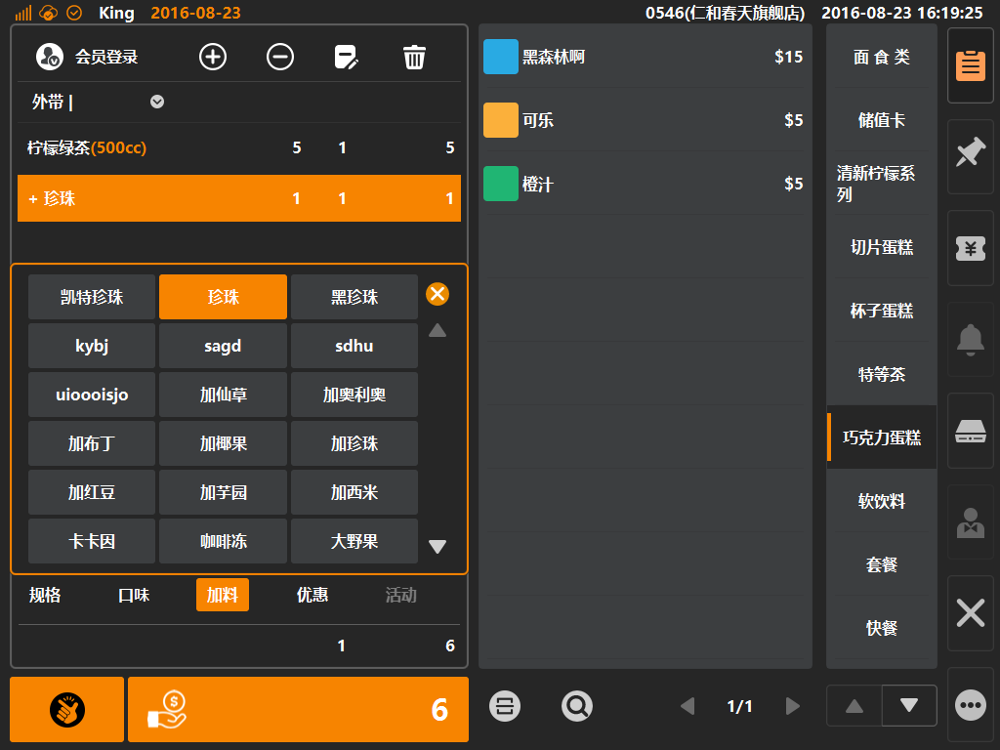

# 优惠  

* ## 商品优惠  
> * 优惠是什么：默认情况有四种优惠，分别是[单品折扣]、[单品折让]、[整单折扣]、[整单折让]，此四种优惠默认由客户端手动输入折扣折让数值；
> * 单品折扣：为单一商品进行百分比打折，如单品80%=单品打八折；
> * 单品折让：为单一商品进行固定金额减价，如单品-5元；
> * 整单折扣：为整单金额进行百分比打折，如整单50%=整单打五折；
> * 整单折让：为整单金额进行固定金额减价，例如整单-8元；

 
1. 选中购物车中商品，如该商品拥有加料，则购物车底部口味字体由置灰变可点击状态，如下图；  
  
  
  
>  * 加料创建：后台登录后，在[商品]分类下的[加料]内进行创建加料分组，创建成功后该分组下添加具体的加料；
>  * 加料可单独为其配置售价；     
  
   
2. 点选[加料]则可弹出加料弹窗，无默认选中，加料允许多选（可单独为加料配置售价）；
  
  
    
> * 加料分组与具体加料可配置排序，具体设定在其属性内填写[显示顺序]编号；  *
> * 如果为[珍珠]这项加料配置售价1元，则表现为在原商品售价上+1元；  
> 

