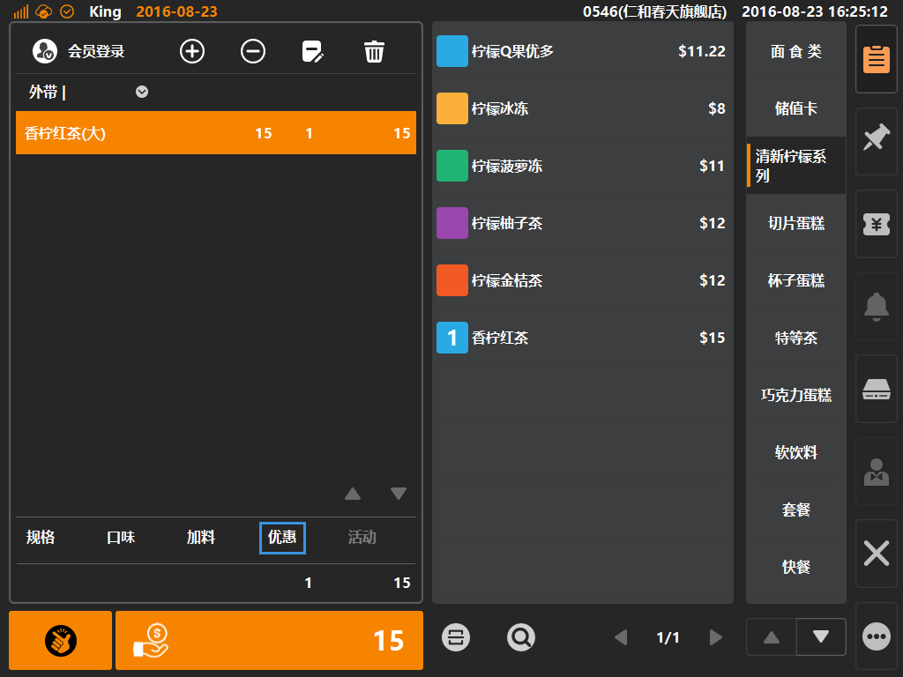
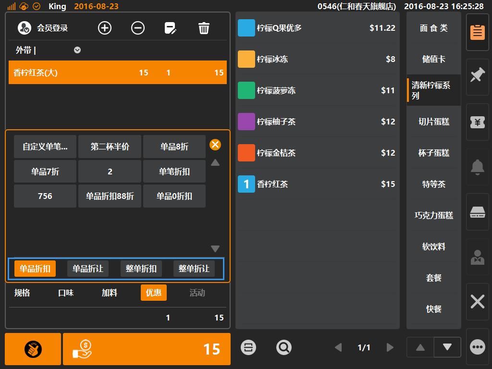
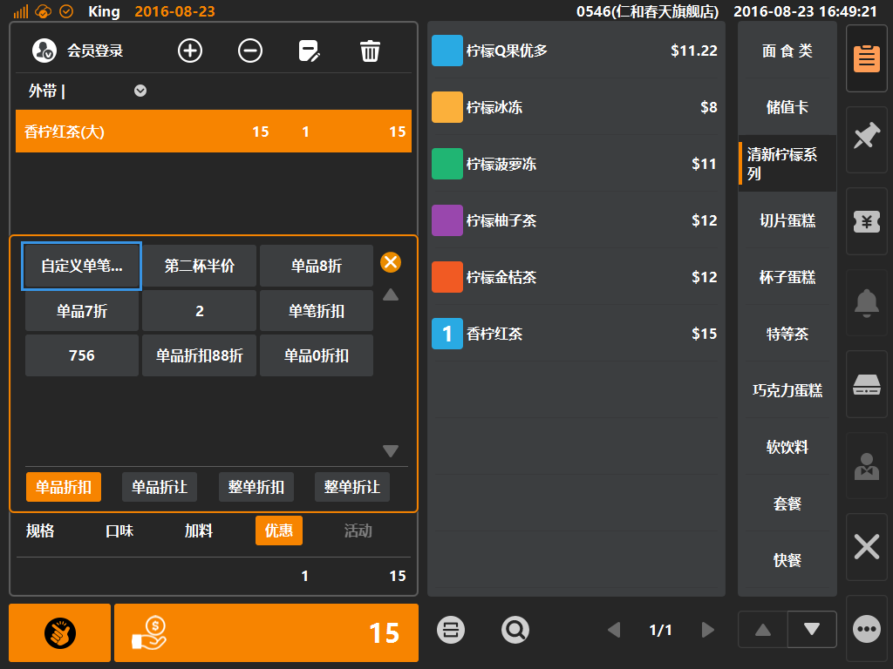
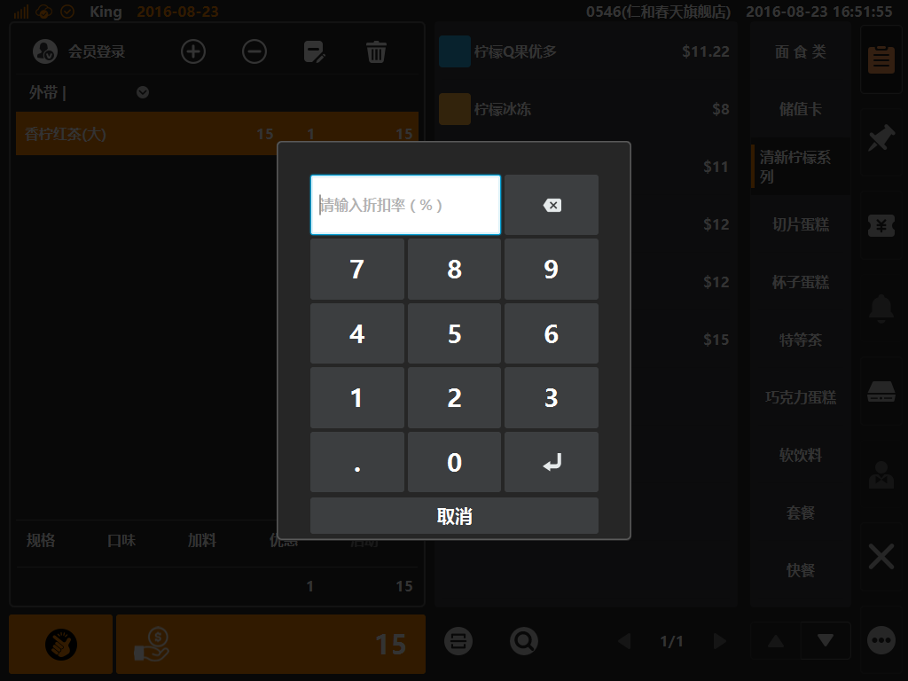

# 优惠  

* ## 商品优惠  
> * 优惠是什么：默认情况有四种优惠，分别是[单品折扣]、[单品折让]、[整单折扣]、[整单折让]，此四种优惠默认由客户端手动输入折扣折让数值；  
> * 可在后台创建快捷折扣按键，即创建一个快捷按键，如新品推荐[单品80%]；则客户端可在优惠内找到并点选该按键，立即自动为所选商品加入打八折的优惠；
> * 单品折扣：为单一商品进行百分比打折，如单品80%=单品打八折；
> * 单品折让：为单一商品进行固定金额减价，如单品-5元；
> * 整单折扣：为整单金额进行百分比打折，如整单50%=整单打五折；
> * 整单折让：为整单金额进行固定金额减价，例如整单-8元；

 
* 选中购物车中商品，如门店有启用折扣按键，则购物车底部优惠字体由置灰变可点击状态，如下图；  
  
  
  
    
  
   
* 点选[优惠]则可弹出优惠弹窗，默认情况下有四种优惠（单品折扣、单品折让、整单折扣、整单折让）如下图，每个按键内都有一个自定义输入按键；
  
  
> * 选中[优惠]，默认情况下系统自动选中单品折扣；  

* 点选[自定义单品折扣]按键，将弹出自定义输入键盘，用户可在该位置输入数值，来决定优惠力度；
  

* 自定义输入优惠键盘效果  
  
> 在空白区域使用键盘输入