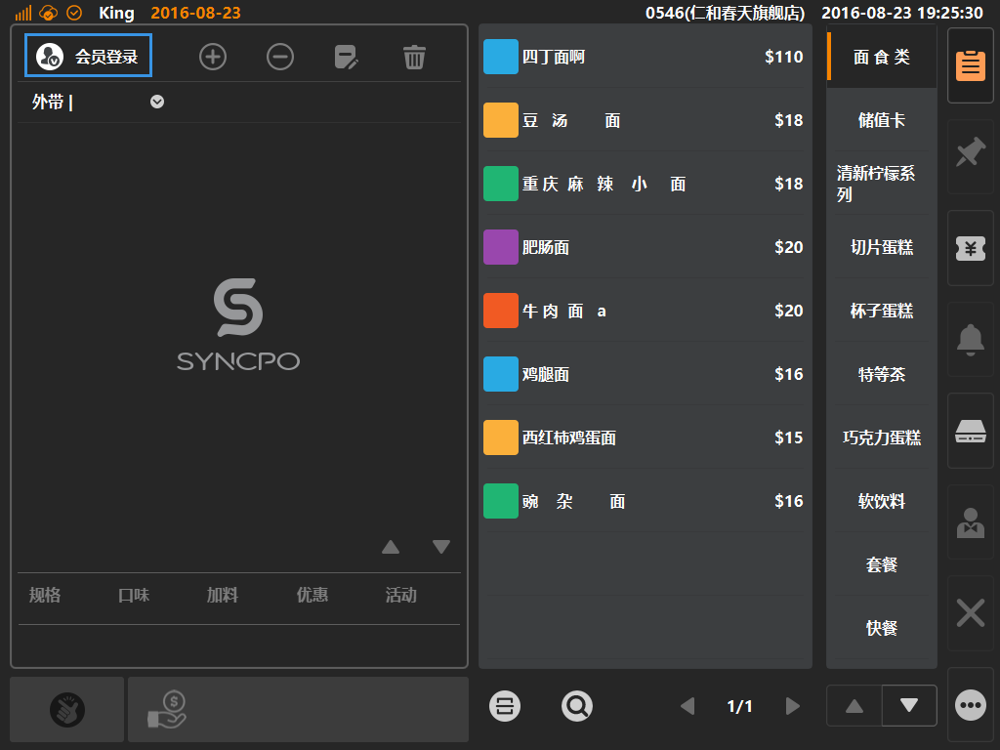
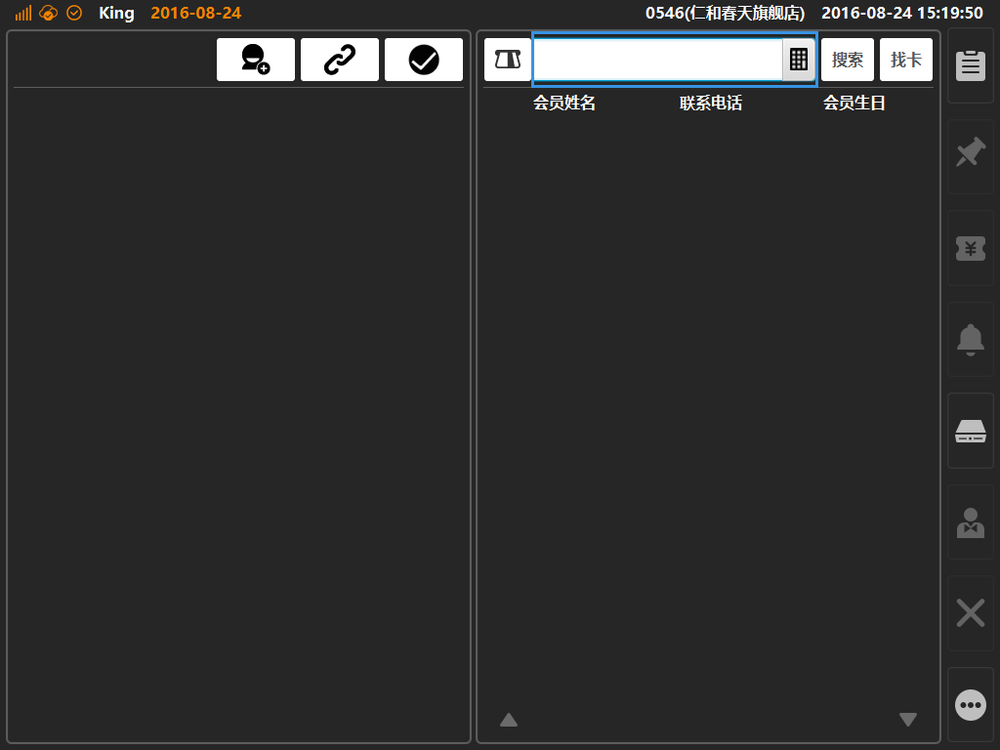

# 会员关联储值卡    
* ## 进入会员管理界面    
> 储值卡为何要与会员账号做关联  
> * 储值卡一般是不记名的，关联会员后，可以在丢失或者破损时进行挂失、换卡等操作；
> * 会员可以让商家更方便的进识别客人身份、追踪会员消费轨迹、让客人享受会员优惠、获得会员积分等优惠措施；
  
1.会员账号关联储值卡操作，需要进入会员管理界面，先点击购物车左上角图标，见下图；  
  
 
2.待弹出读卡弹窗后，点击[进入会员管理]，可进入会员管理功能界面；  
  
   
* ## 会员管理界面
3.进入会员管理界面后，首先通过查询找到要关联储值卡的会员账号；  
* 搜索会员：输入会员姓名、会员电话点击[搜索]按键进行查询（支持模糊搜索）；  
* 搜索卡号：通过储值卡号查询与之关联的会员账号，输入卡号后点击[找卡]按键进行查询（不支持模糊搜索，需要输入完整的卡号）；
  
 
4.查询后结果展示如下图，如选中查询结果，可显示会员详情及与之关联的储值卡信息，最后可通过点击[确认]（蓝色方框内按键）来登录当前选中会员；
  
 