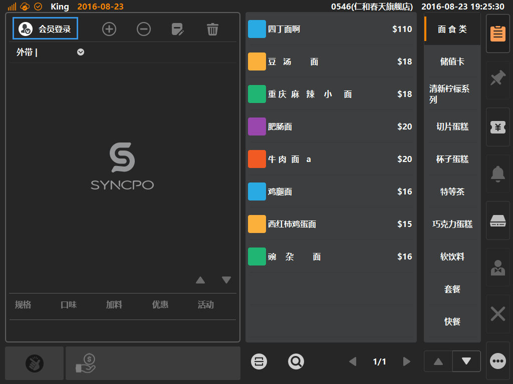
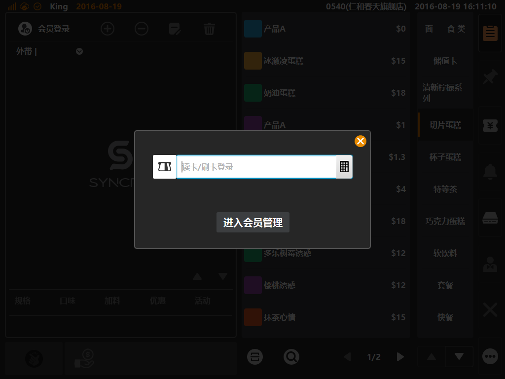
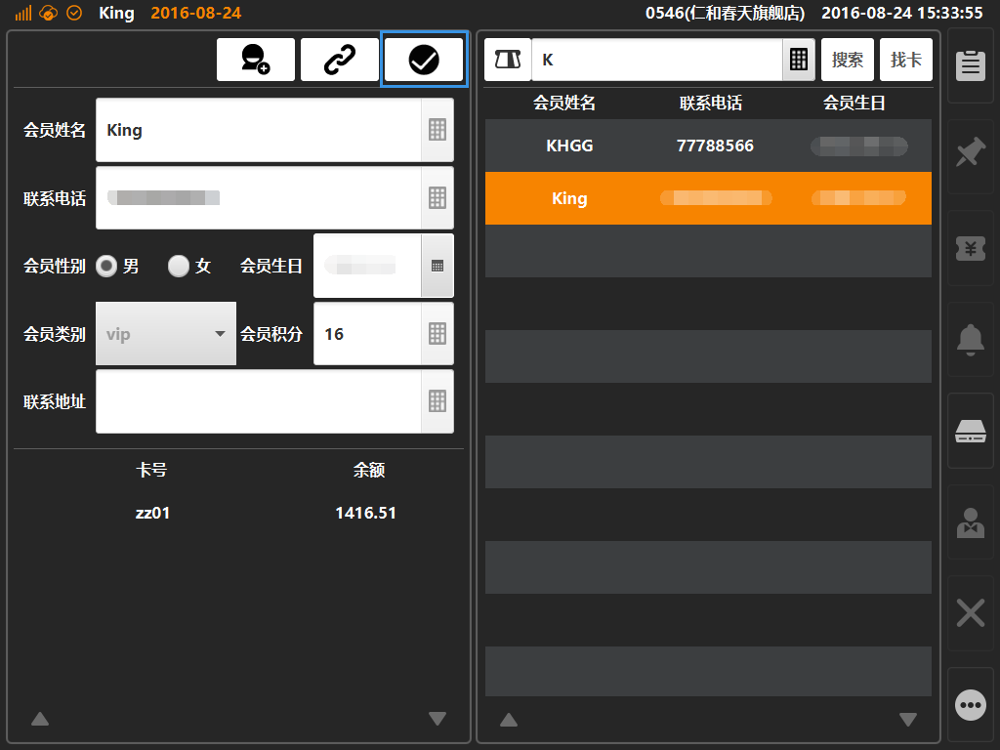
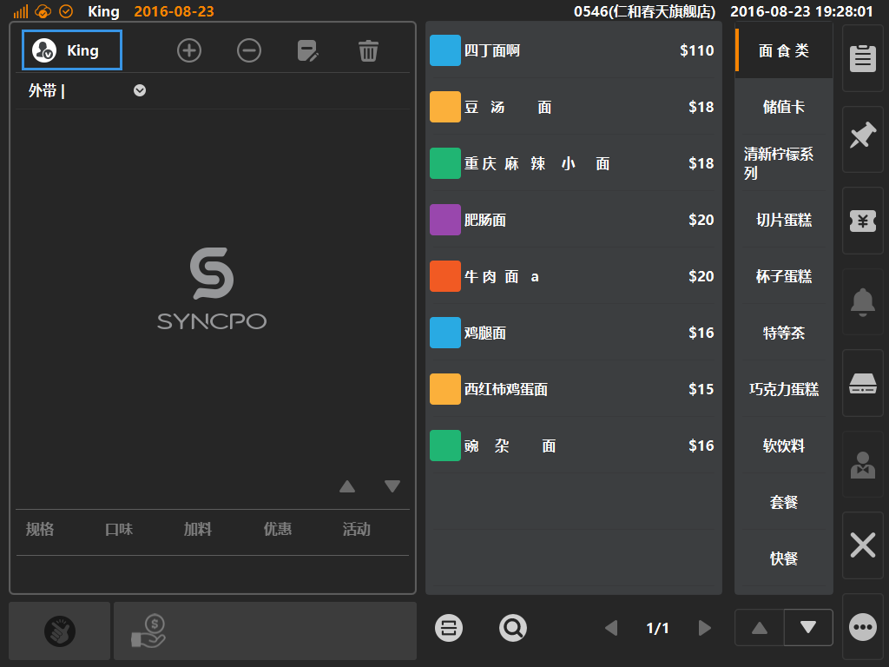

# 会员搜索  
* ## 购物车登录  
1.会员搜索需要进入会员管理界面，先点击购物车左上角图标，见下图；  
  
 
2.待弹出读卡弹窗后，点击[进入会员管理]，可进入会员管理功能界面；  
  
 
3.进入会员管理界面后，在下图标示栏位内输入要查询的会员账号；  
* 搜索会员：输入会员姓名、会员电话点击[搜索]按键进行查询（支持模糊搜索）；  
* 搜索卡号：通过储值卡号查询与之关联的会员账号，输入卡号后点击[找卡]按键进行查询（不支持模糊搜索，需要输入完整的卡号）；
  
4.查询后结果展示如下图，查询后选中查询结果，可显示会员详情及与之关联的储值卡信息，最后可通过点击[确认]（蓝色方框内按键）来登录当前选中会员；
  
5.登录成功后，将在购物车的登录会员按键处，展示[会员姓名]，如下图；  
  
> 如要切换其他会员，可点击[会员登录]，在登录弹窗或者会员管理界面内二次登录；