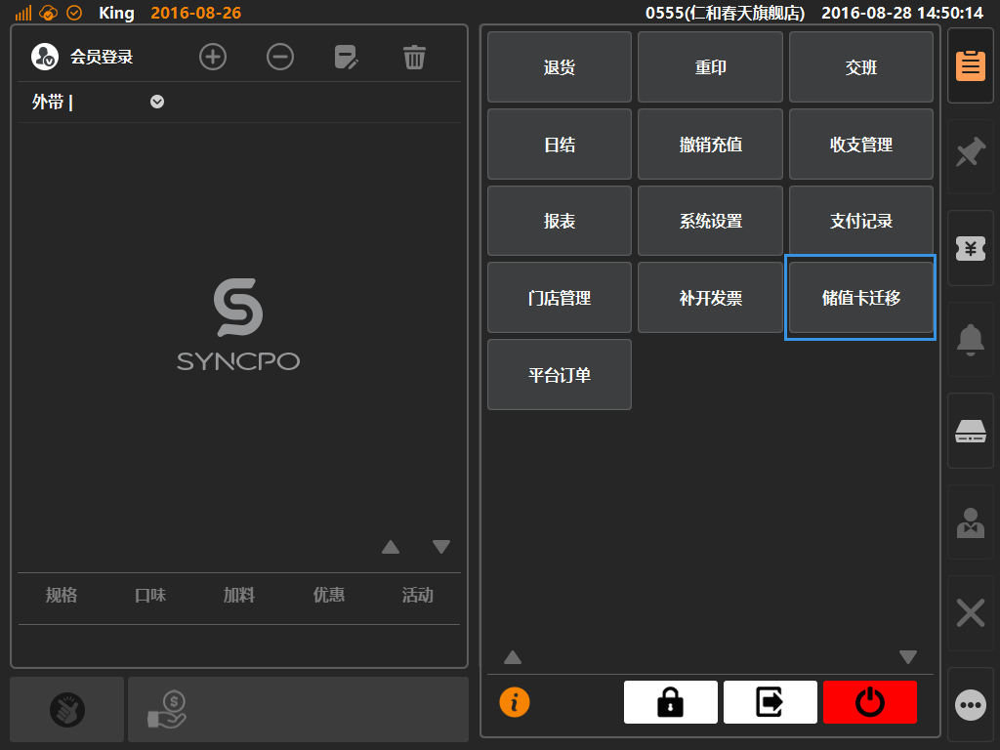
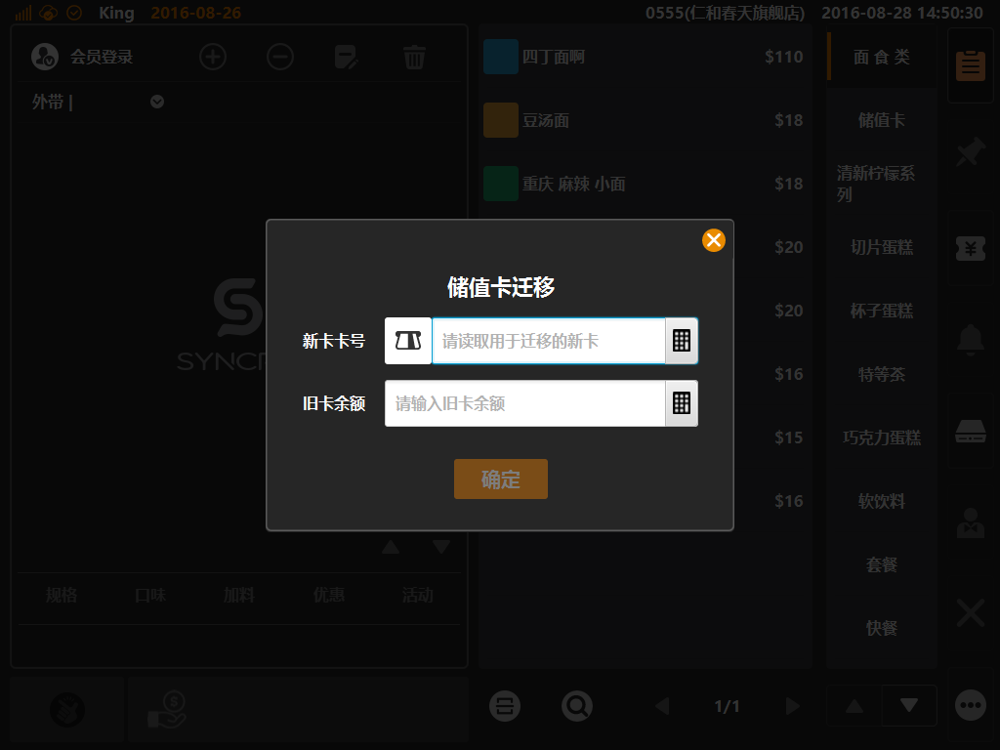

# 储值卡迁移    
> * 储值卡迁移：适用于商家拥有旧有储值卡系统，替换系统后，对旧有持卡客户进行新卡替换操作；  

* ## 操作说明
* 1.点击主功能按键区的[更多功能]按键内的[储值卡迁移]，将弹出储值卡迁移选项；    
  
  

* 2.进入弹窗界面，在[新卡卡号]内读取或输入新卡编号，在[旧卡余额]内输入客户持有的旧卡余额，保存后生效；  
> * 储值卡迁移后，在本系统内，客户的新储值卡生效；  
  
