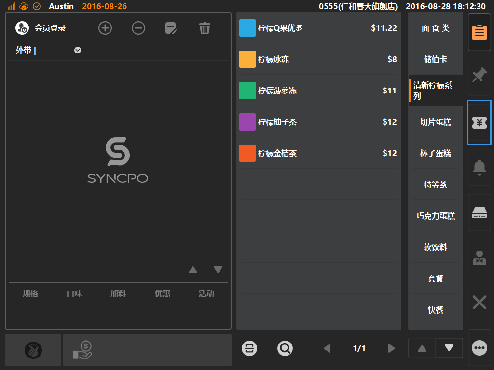
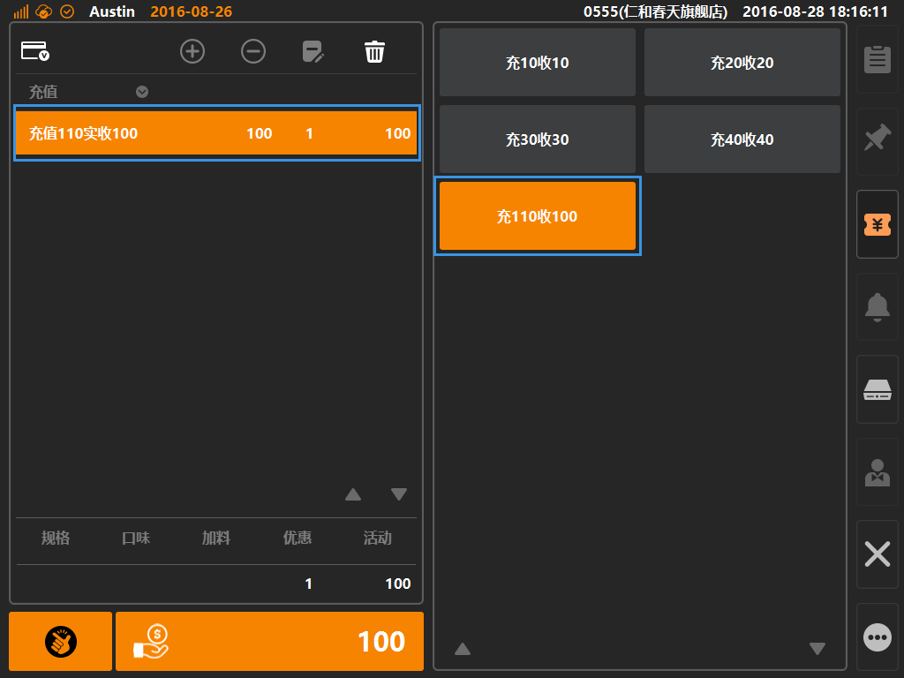
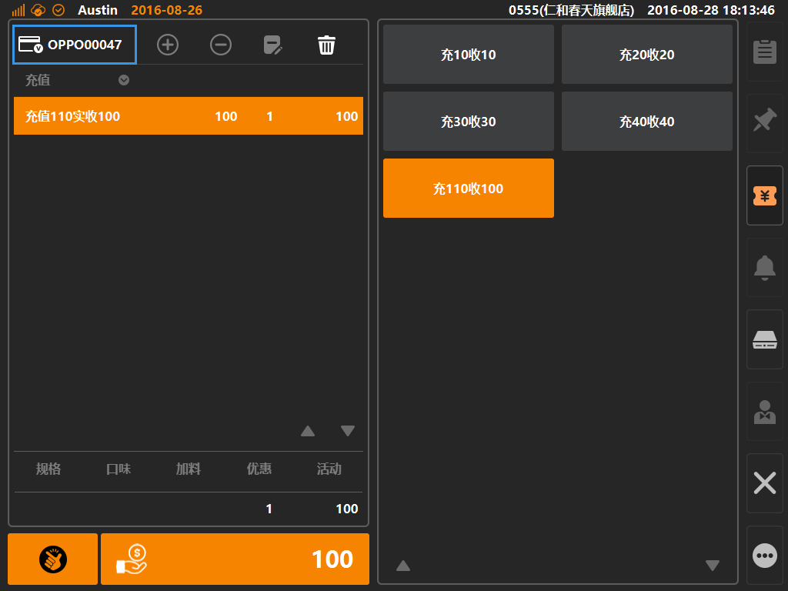
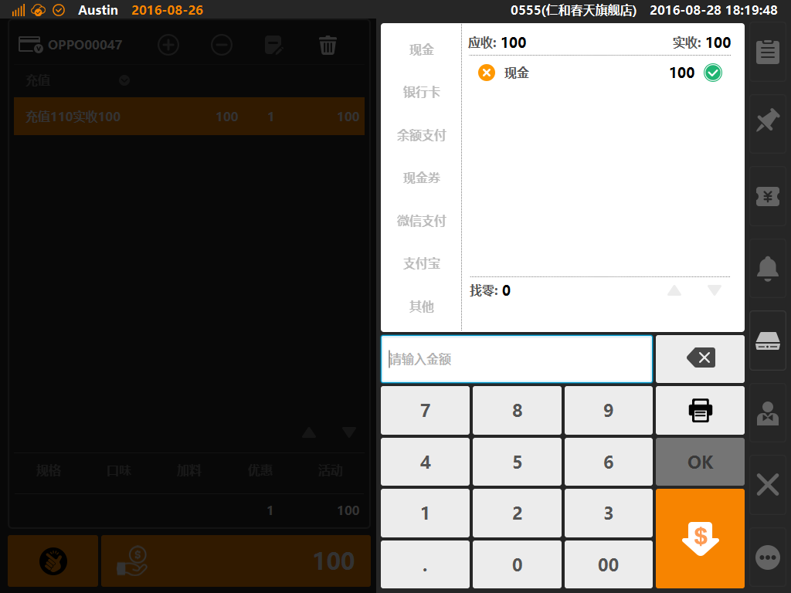

# 充值  

* ** 第一步：点击主功能按键区域的[充值]按键**  
 
   
  

> *充值操作，通过点击充值金额（后台需预先设定储赠规则），将充值金额加入购物车，读卡充值对象，最后进行收银结账动作；  

* **第二步：点击要充值的金额区块加入购物车；**  

> * 后台充值规则，在后台位置的[销售]分类下的[充值规格]下创建；     

* **第三步：读取储值卡或者输入储值卡号；**  

* **第四步：进入收银界面，进入收款流程完成交易；**  

