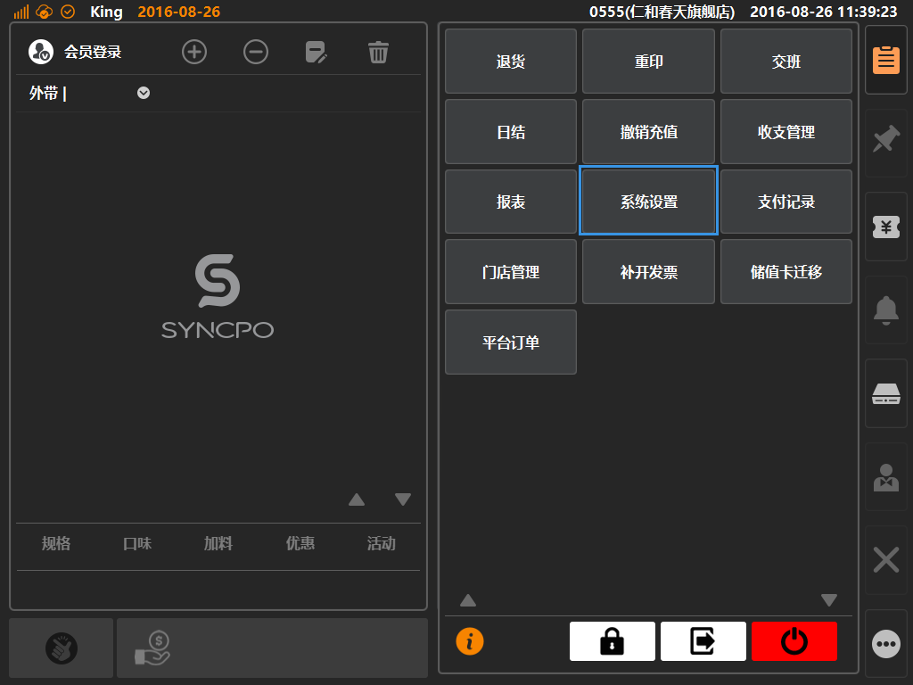

# 出单设置  
> * 出单设置：为[厨房]与[标签]类型的打印机配置需要打印的商品信息；  

* ## 操作说明
* 1.点击主功能按键区的[更多功能]按键内的[系统设置]，将进入系统设置界面；  

  

* 2.系统设置界面内，点击选中[出单设置]，通过选择打印机，来配置该打印机打印的商品信息；   
 

> * 勾选分类下方的商品，保存后生效，每个分类需要分别保存一次；
> * 如A商品有勾选，B商品未勾选，当一次收银内包含A、B两个商品时，[厨房]与[标签]将只对A商品进行打印；

  

  
  

