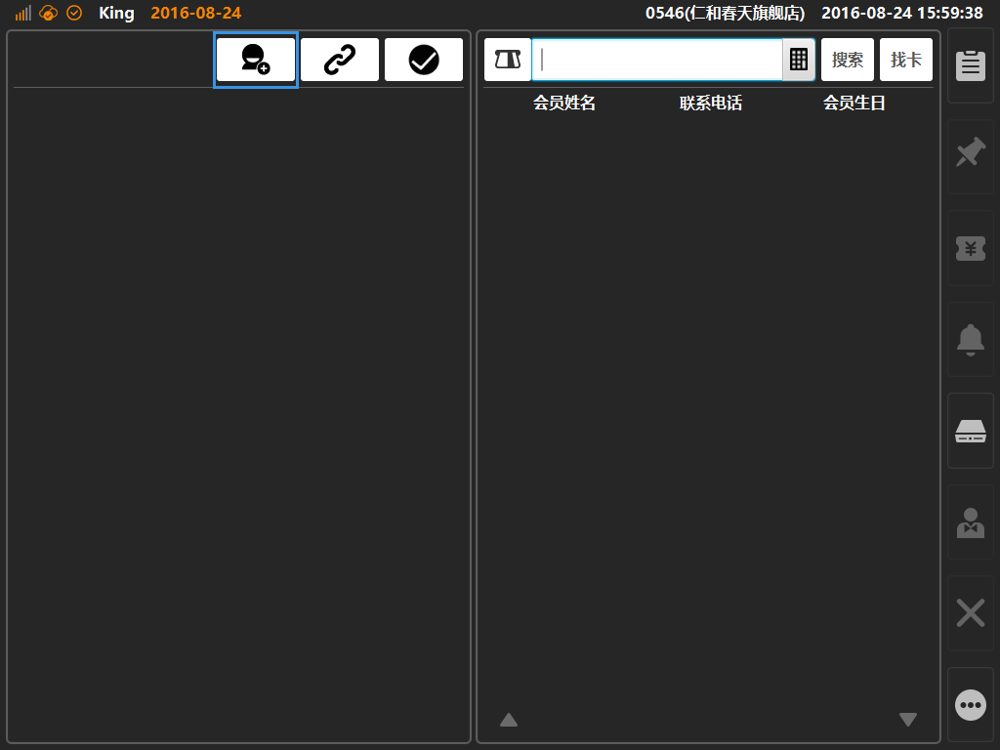
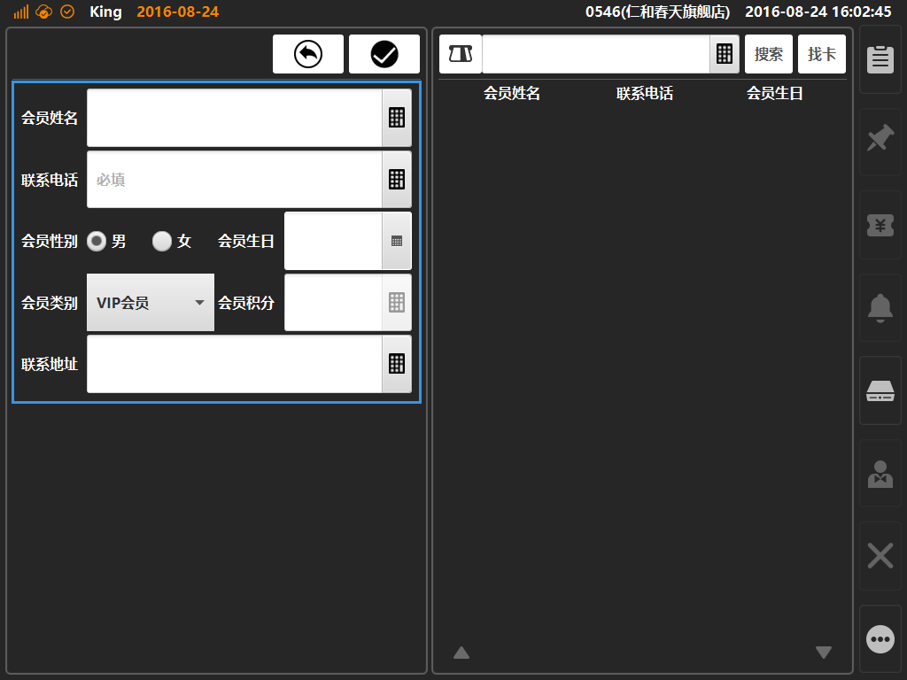

# 创建会员  
* ## 进入会员管理界面  
点击购物车左上角[会员登录]按键，在弹窗上点击[进入会员管理]按键，进入会员管理界面；  
  
 
2.待弹出读卡弹窗后，点击[进入会员管理]，可进入会员管理功能界面；  
   
 
3.在[会员管理]界面内，点击新增会员按键[]，即可新建会员；  
  
 
4. 在该界面内输入会员信息，填写完成后点击[],保存后新建会员成功；  
  
> [联系电话]：新建会员的必填选项；

