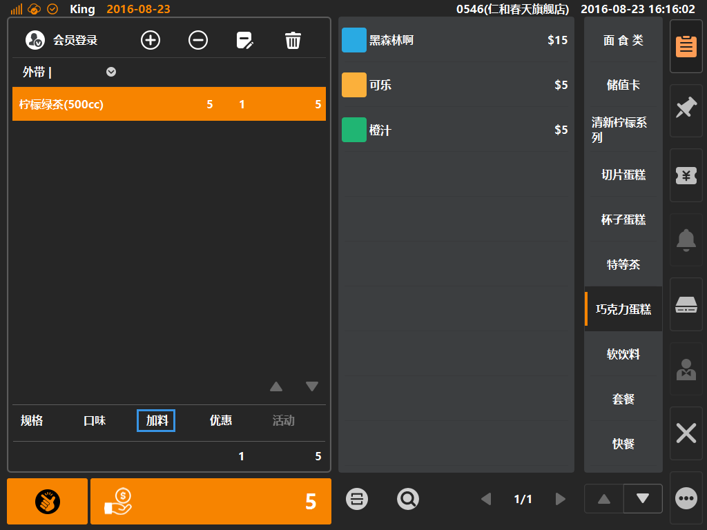

# 加料  

* ## 商品加料  
> * 加料是什么：加料常用在饮品商品里，如为奶茶创建[一元料品]分组，分组内有加珍珠、加仙草等，用于热食，如为面食类商品创建[加料]，则分组内为加牛肉、加臊子等 ；
> * **加料默认为多选方式**，且可为不同的加料单独配置售价；  

 
1. 选中购物车中商品，如该商品拥有加料，则购物车底部口味字体由置灰变可点击状态，如下图；  
  
  
  
>  * 加料创建：后台登录后，在[商品]分类下的[加料]内进行创建加料分组，创建成功后该分组下添加具体的加料；
>  * 加料可单独为其配置售价；     
  
   
2. 点选[加料]则可弹出加料弹窗，无默认选中，加料允许多选（可单独为加料配置售价）；
  
  
    
> * 加料分组与具体加料可配置排序，具体设定在其属性内填写[显示顺序]编号；  *
> * 如果为[珍珠]这项加料配置售价1元，则表现为在原商品售价上+1元；  
> 

