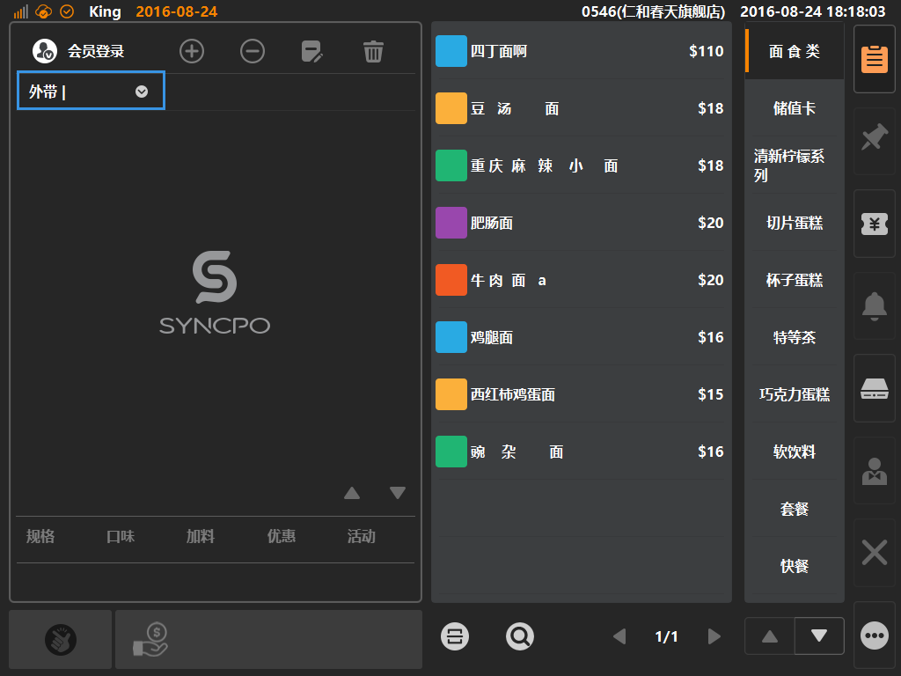
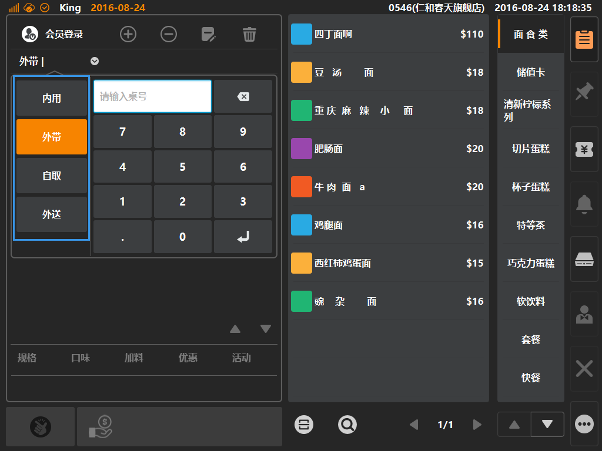

# 单据类型按键  
> * 单据类型是什么：系统默认带有四种单据类型，分别是内用、外带、自取、外送；  
> * 内用：堂食，店内用餐等单据；  
> * 外带：打包，店内点单打包带走（系统默认外带）；  
> * 自取：上门，客人通过远程下单，约定时间上门取货；
> * 外送：外卖，客人通过远程下单，要求商户负责配送到指定地点；  
  
* ## 按键位置  
在购物车左上角，点击下图标示位置，可弹窗选择单据类型（默认为外带类型单据）；  

> [默认外带]：每次点单固定为外带类型；  
> 单据类型的默认状态可变更，具体设置在[主功能按键]下，点击[更多功能]，进入[系统设置]界面，选择[基本设置]，可选默认指定的单据类型；

* ## 删除操作说明  
选中要删除的条目，可对选中的天目进行删除动作，[删除]按键允许删除购物车内条目内容，内容不限于商品，同时允许删除加料、优惠、活动；   

  
