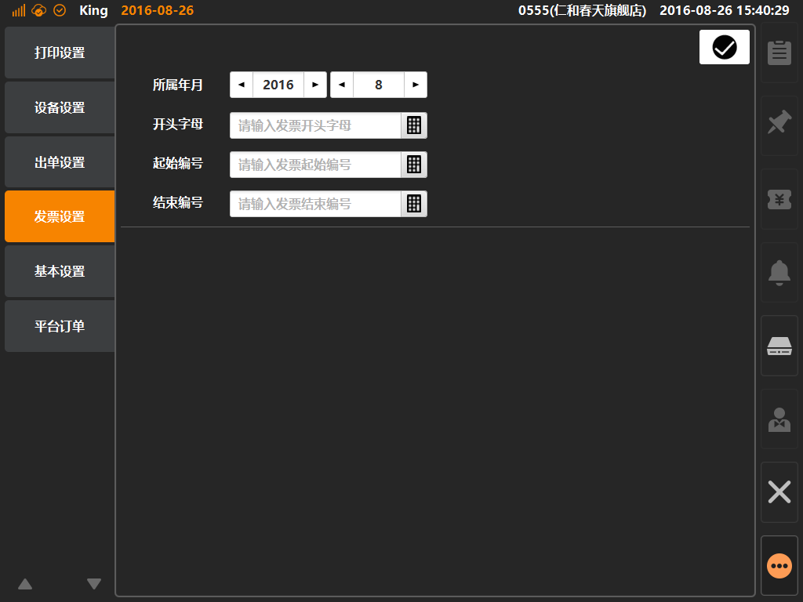

# 发票设置  
> * 发票设置（台湾地区专用）：台湾地区零售行业标准，需要对每一笔交易进行统一发票打印；  

* ## 操作说明
* 1.点击主功能按键区的[更多功能]按键内的[系统设置]，将进入系统设置界面；  

  

* 2.系统设置界面内，点击选中[发票设置]，对发票基本信息进行设置；   
 

> * 所属年月：根据当前日期配置；  
> * 开头字母：每个月台湾地区税务机构将变更当月的统一发票抬头编码字母（两位大写字母）；
> * 起始编号：根据商家放置如打印机内的发票起始编号，填入发票编号（八位数字）；
> * 结束编号：根据商家放置如打印机内的发票结束编号，填入发票编号（八位数字）

  

  
  

