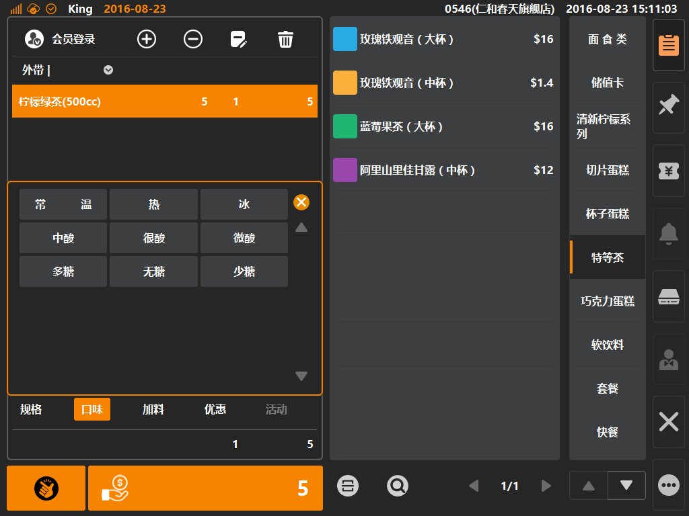

# 口味  

* ## 商品口味  
> * 口味是什么：口味在饮品内多以[温度]呈现，如温热、去冰、冰等；在热食内多以[辣度]呈现，如不辣、微辣、辣等；也可视为商品备注类信息，如不加葱、不放香菜、清汤等；
> * **口味可根据后台配置是否可多选**，如上述例子[温度]类别下的口味需要配置为单选模式，而备注类信息（不加葱、不放香菜）则需要配置为允许多选的模式；  

 
1. 选中购物车中商品，如该商品拥有口味，则购物车底部口味字体由置灰变可点击状态，如下图；  
  
  
  
>  * 口味创建：后台登录后，在[商品]分类下的[口味]内进行创建口味分组，创建成功后该分组下添加具体的口味；   
  
   
2. 点选[口味]则可弹出规格弹窗，无默认选中，根据配置，不同口味分组下可多选也可单选（口味不影响商品售价）；
  
  
    
> * 口味分组与具体口味可配置排序，具体设定在其属性内填写[显示顺序]编号；

