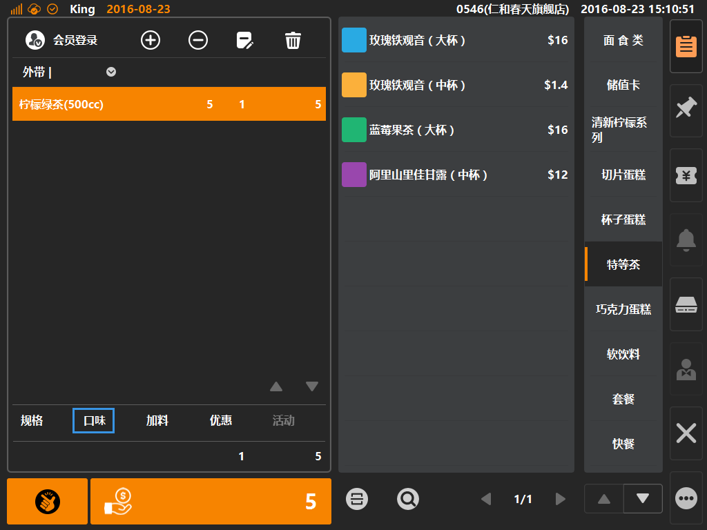

# 口味  

* ## 商品口味  
> * 口味是什么：口味在饮品内多以[温度]呈现，如温热、去冰、冰等；在热食内多以[辣度]呈现，如不辣、微辣、辣等；也可视为商品备注类信息，如不加葱、不放香菜、清汤等；
> * **口味可根据后台配置是否可多选**，如上述例子[温度]类别下的口味需要配置为单选模式，而备注类信息（不加葱、不放香菜）则需要配置为允许多选的模式；  

1. 选中购物车中商品，如该商品拥有口味，则购物车底部口味字体由置灰变可点击状态，如下图；  
  
> * 规格创建：后台登录后，在[商品]分类下的[规格]内进行创建规格，创建成功后在商品属性内为该商品选择规格；   
  
   
2. 点选[规格]则可弹出规格弹窗，默认选中一种规格，可选其他规格（不同规格允许不同售价）；
   
> * 规格的使用为单选模式；  
> * 默认选中的规格按创建的先后顺序，越早创建的规格优先选中；
> * 同一商品多个规格的创建方法：以上图为例，首先创建三种规格，分别是500cc、400cc、700cc；之后创建三个柠檬绿茶商品，分别为每个柠檬绿茶指定一个规格，保存后下派数据；客户端将自动合并同名商品，且呈现三个可选规格；

