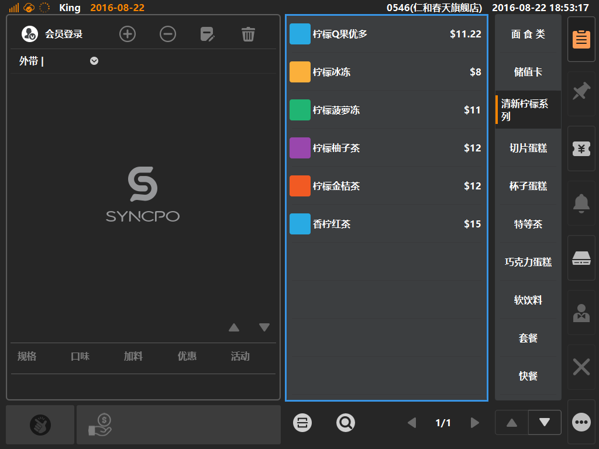
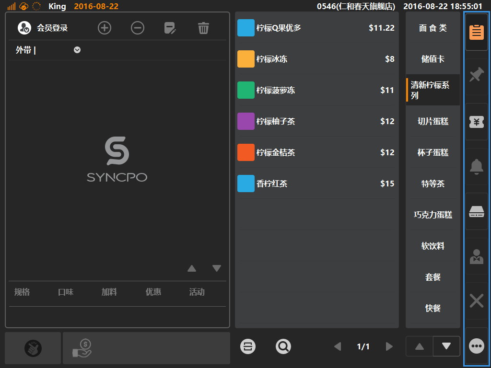
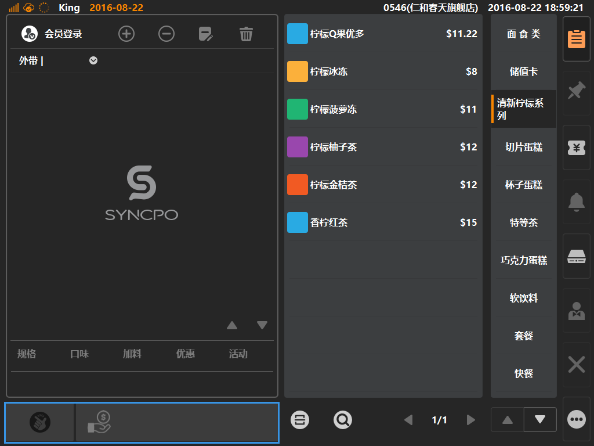
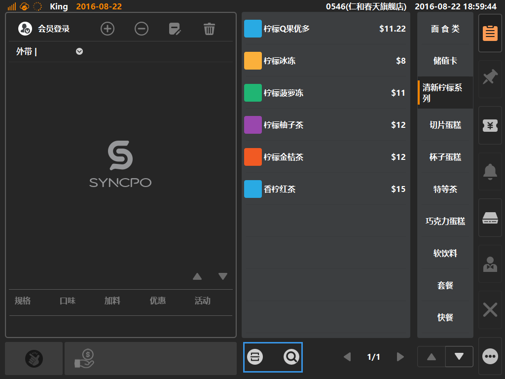

# 基本界面

* ## 1、购物车区域  
如图：蓝色方框内为购物车区域；  

> 购物车实现购物清单等功效，收银员将客人点单的商品统一加入购物车后，可对商品进行修改、编辑、增加、删除等功能；  
> 同时也可进行会员账号登陆，修改单据类型，增加临时桌号；  
> 底部可根据商品选择规格/口味/加料/优惠/活动等信息；  

* ## 商品中类区域  
  
> 商品归属与商品中类下，选择商品中类可快速查询具体商品  

* ## 商品区域  
  
> 商品区域：根据选择不同的中类展示不同分类下的具体商品  

* ## 主功能按键区域  
  
> 常用功能按键区域（从上到下）：商品界面、临时挂单功能、充值界面、通知中心（未开放）、手动开启钱箱、会员管理（未开放）、重置清空界面、更多功能按键；  

* ## 收银按键
  
> 当购物车内存在商品时，点击收银按键，可进入结账界面  

* ## 辅助点单功能区域  
  
>  辅助点单功能按键（从左到右）；  
>  * 扫码点单：使用外接设备“扫描枪”，扫描商品条码，可快速将商品加入购物车 （可在后台[商品]分类下的[商品资讯]内，点击具体商品，将出现商品详情，在“商品条形码”内填写商品条码） 
>  * 搜索点单：进入商品搜索界面，可搜索商品编码与商品价格  （可在后台[商品]分类下的[商品资讯]内，点击具体商品，将出现商品详情，在“定价”内填写商品售价，如门店采用[价格策略]范本，则以价格策略范本的售价为搜索条件）
>  * PS：[价格策略]用于同一商品在不同门店采用不同售价策略情况下使用；
>