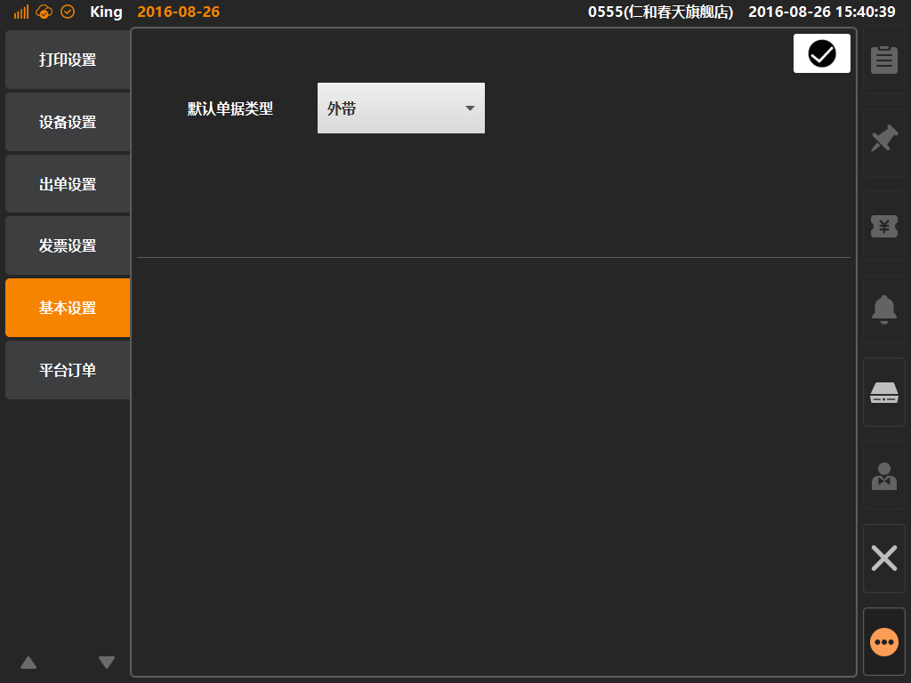

# 基本设置  
> * 基本设置：为系统指定默认的单据类型，如指定默认为内用；  
> * 商家可根据其自身业务的偏向，来配置默认单据类型，可减少操作动作，提高效率；
> * 如内用（堂食）类型单据，出菜需要端盘，外带（打包）类型单据，出菜需要包装；

* ## 操作说明
* 1.点击主功能按键区的[更多功能]按键内的[系统设置]，将进入系统设置界面；  

  

* 2.系统设置界面内，点击选中[基本设置]，可查看及编辑默认单据类型，通过下拉选择修改默认值，点击右上角[确认]保存生效；   
 

  

  
  

