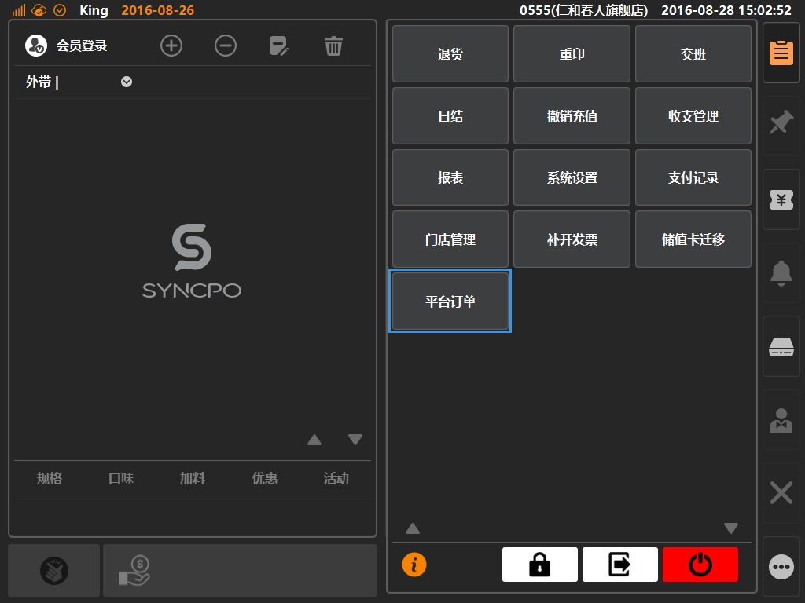
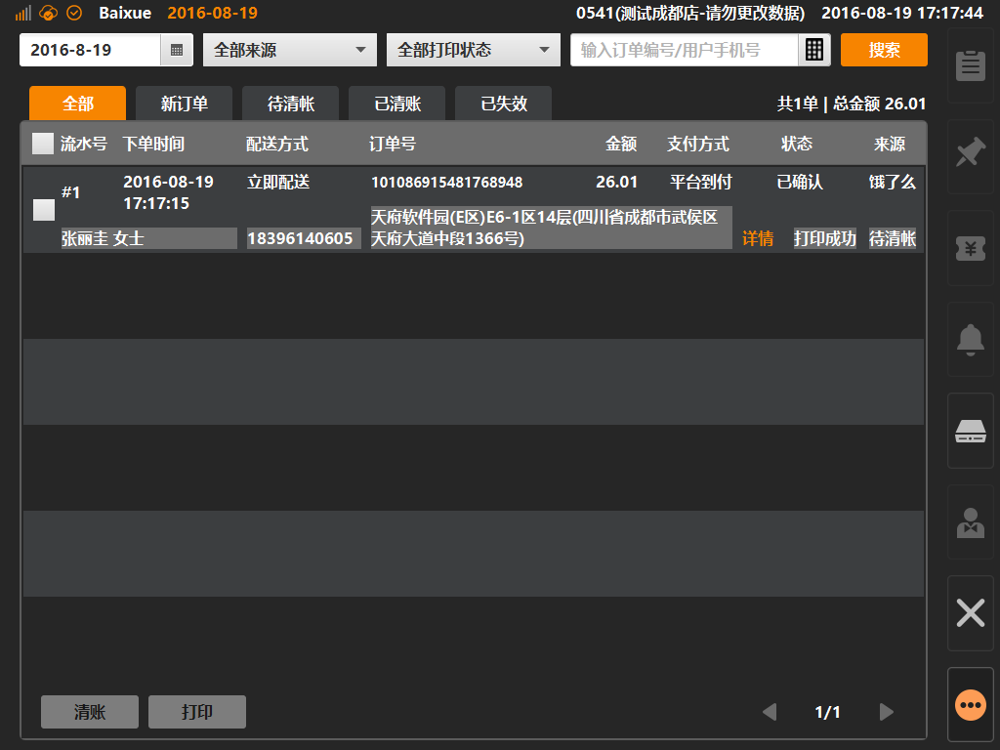

# 平台订单  

> * 平台订单：展示商家在后台开通的第三方外卖平台订单信息；  
> * 商户可在该界面内进行所有第三方平台订单查询、打印、清帐等动作；
> * 清帐：将平台外卖订单转化为系统销售单据，经过清帐操作的外卖订单，外卖订单销售数据可计入系统，可在交班、日结、报表等信息中进行查询与统计；  
> 

* ## 操作说明
* 1.点击主功能按键区的[更多功能]按键内的[平台订单]，将进入[平台订单]界面；    
  
  

* 2.进入平台订单界面，可在头部进行订单信息过滤查询，默认以查询当天的外卖单据；  
> * 打印：通过点击勾选外卖单据，之后点击[打印]按键对订单进行配送单据的打印；  
> * 清帐：通过点击勾选外卖单据，之后点击[清帐]按键对订单进行清帐操作（点击全选复选框可一次性对所选分类的单据进行批量选中操作）；

  
  

* 3.清帐操作，选择[待清帐]页面，点击[全选]复选框，点击[清帐]按键；  

> * 清帐一般发生在交班或者日结之前，可在[待清帐]界面，点击全选效果，之后点击[清帐]，可批量对所有未清帐的外卖单据进行统一转化系统订单等操作；  

* 4.系统弹窗[清帐]详情界面，在界面内可查看勾选的外卖订单分类详情，确认无误后点击清帐，将批量进行系统单据转化；  

