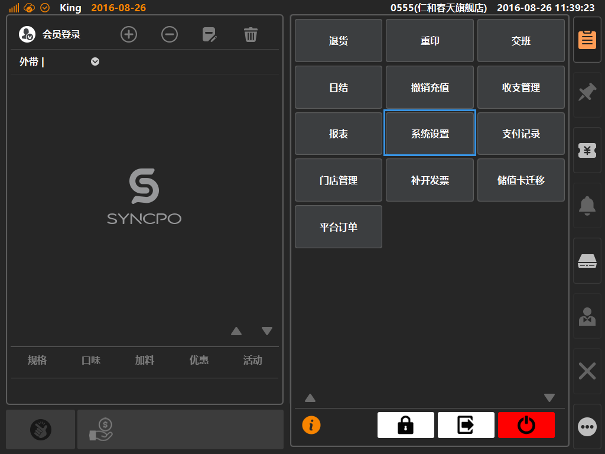
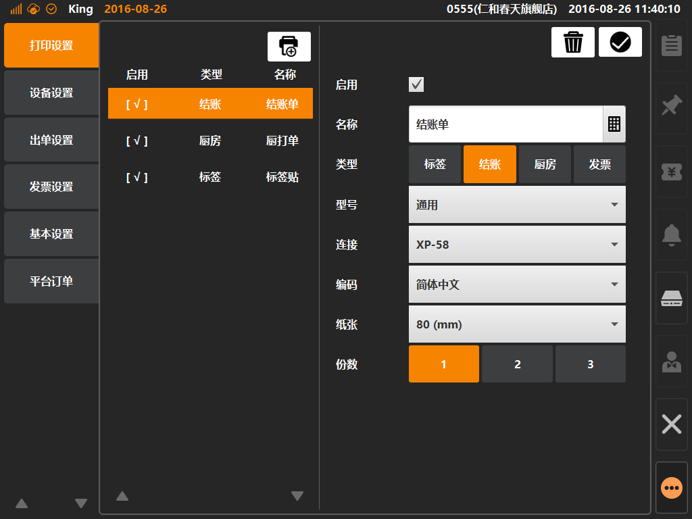

# 打印设置  
> * 打印设置：打印机添加与配置的位置，可创建四种类型打印：1、结账；2、标签；3、厨打；4、发票（台湾地区专用）；  

* ## 操作说明
* 1.点击主功能按键区的[更多功能]按键内的[系统设置]，将进入系统设置界面；  

  

* 2.系统设置界面内，默认选中[打印设置]，左侧界面为打印机列表，右侧为打印机设置详情；   

 ：添加打印机按键，点击可新建一个打印机；  
 
 ：删除打印机按键，点击可删除一个已创建的打印机；  
 
 ：保存打印机配置，点击可保存新建打印机或者保存修改后打印参数；   
 

* ## 设置选项说明
* 启用：勾选保存后打印机生效，未勾选则为停用状态；
* 类型：选择打印机类型，根据选择打印不同的打印模板；  
> 打印模板选择在后台[系统]分类下的[票据格式]下进行选择；  
* 型号：默认通用，无需选择；
* 连接：选择连接的设备驱动，或者无驱动类型设置的连接端口；
* 编码：根据所在地区选择输出语系；
* 纸张：根据打印纸选择纸张尺寸；
* 根据商家需求选择一次打印份数（可选份数1张~3张）； 

  

  
  

