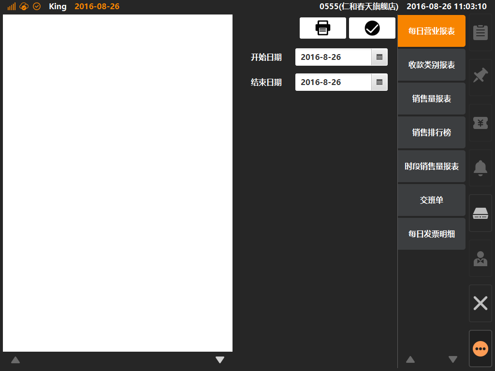

# 打印设置  
> * 打印设置：打印机添加与配置的位置，可创建四种类型打印：1、结账；2、标签；3、厨打；4、发票（台湾地区专用）；  

* ## 操作说明
* 1.点击主功能按键区的[更多功能]按键内的[系统设置]，默认选中[打印设置]；  

  

* 2.报表查询界面内，默认选中[每日营业报表]，左侧界面为报表明细，右侧为报表选择与查询条件；  

  

* 3.收支查询界面内，点击查询将根据查询条件筛选出报表，并展示在左侧，此时可点击打印图标进行报表打印；  

  
  

