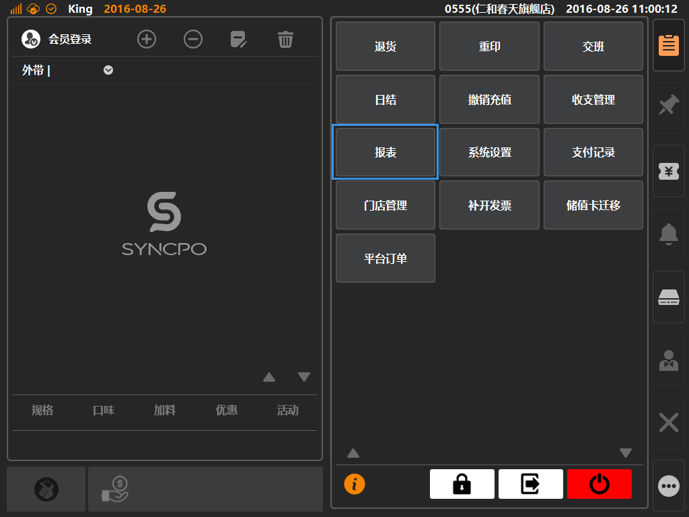
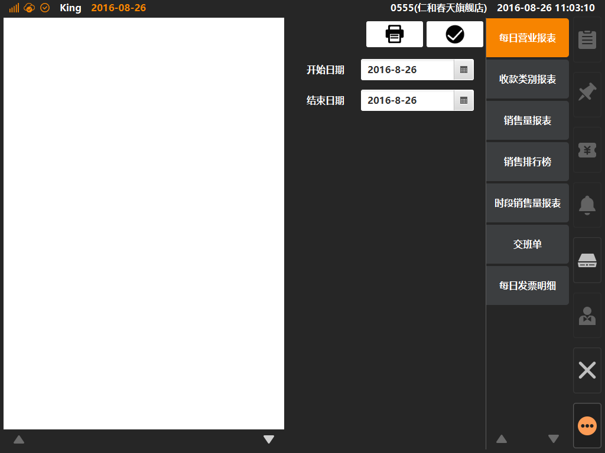
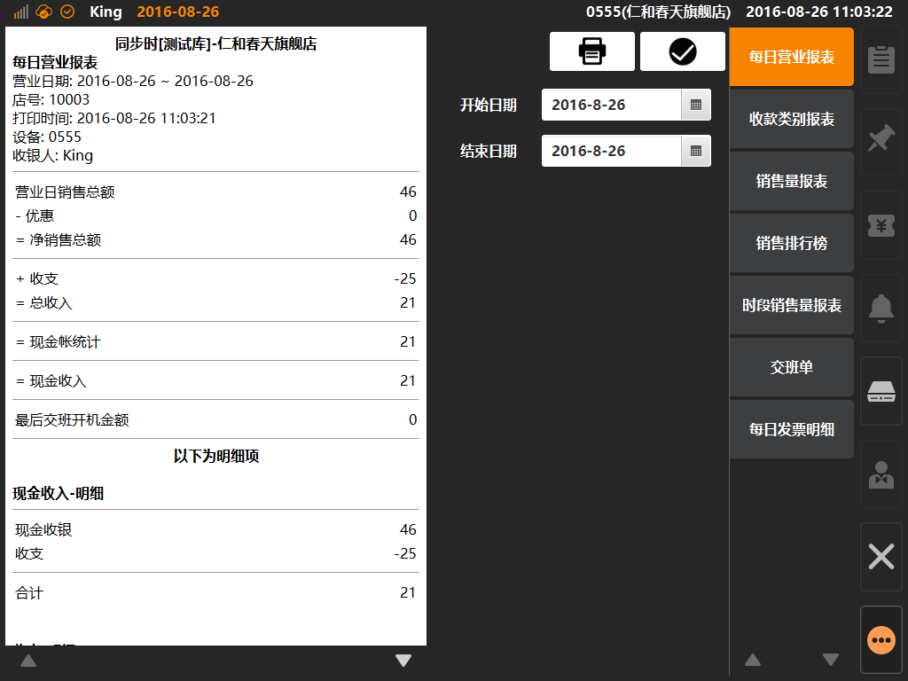

# 报表  
> * 报表是什么：报表就是将系统所有产生的数据用表格、图表等格式来动态显示数据，使用专业的报表结构来动态的加载数据；  

* ## 操作说明
* 1.点击主功能按键区的[更多功能]按键内的[报表]，将展示进入报表查询界面；  

  

* 2.报表查询界面内，默认选中[每日营业报表]，左侧界面为报表明细，右侧为报表选择与查询条件；  

  

* 3.收支查询界面内，点击查询将根据查询条件筛选出报表，并展示在左侧，此时可点击打印图标进行报表打印；  

  
  

