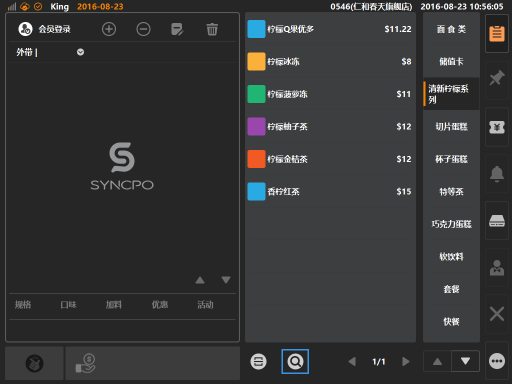
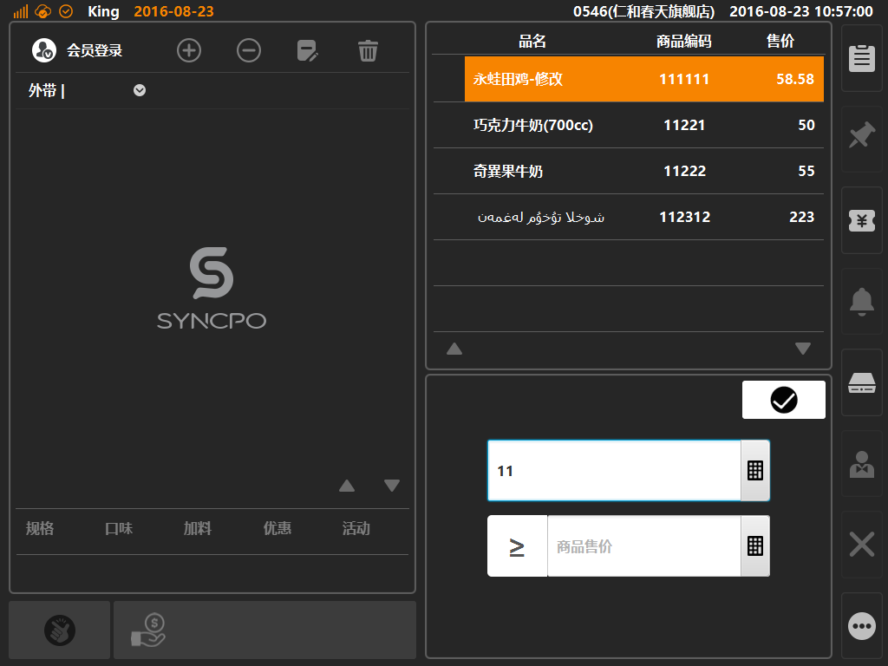

# 搜索点单  
* ##搜索按键  
* **第一步：点击搜索按键**  
* 点击搜索按键，将进入商品搜索界面；  
 

* **第二步：输入数值进行搜索**  
  
> * 搜索类型1：支持商品编码搜索，输入编码的头部信息，可模糊匹配出符合的商品，以列表形式展示;  
> * 搜索类型2：支持商品价格搜索，输入商品价格，可选大于等于或者小于等搜索条件，可匹配出符合条件价格的商品，以列表形式展示；  
> * 支持通过外接键盘输入，能有效提高点单效率；  
> 