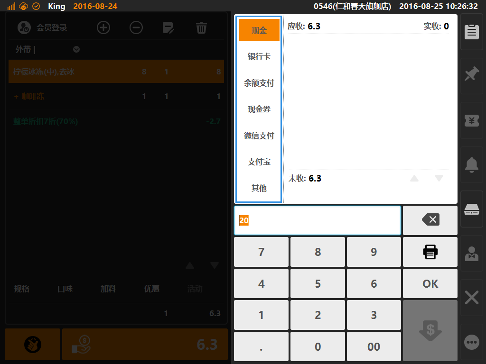

# 支付方式说明

* ## 支付方式位置  
点击一般结账按键，进入支付方式选择界面，如下图，蓝色方框内可选择支付方式，包含现金、银行卡、余额支付（可选会员余额、储值卡余额）、现金券、微信支付、支付宝、其他支付等；  
 * **支付方式说明**
 * 现金：适用与现金支付场景（可配置多币种支付，需要在后台位置的[系统]分类下[汇率]创建币种转化汇率）；
 * 银行卡：作为记账识别的支付方式（无需连接POS终端），一般用于银联、信用卡等支付方式；  
 * 余额支付：适用于电子会员储值、实体卡储值的余额支付方式场景；
 * 现金券：适用于客人适用商家发放或出售的现金抵用券等支付场景（现金券需要在后台创建并出售，在支付时需要联网校验核销）；
 * 微信支付：适用于使用微信支付的客人，允许商家使用“扫码枪”扫描客人支付码进行扣款的支付场景（后台配置位置，在[服务]分类下的[微信支付]下创建）；
 * 支付宝：适用于使用支付宝支付的客人，允许商家适用“扫码枪”扫描客人支付吗进行扣款的支付场景（后台配置位置，在[服务]分类下的[支付宝支付]下创建）；  
 * 其他支付：适用于不属于系统已有的支付方式，商家在后台自定义创建支付名，新创建的支付方式统一归属于其他类别下；
  
 
