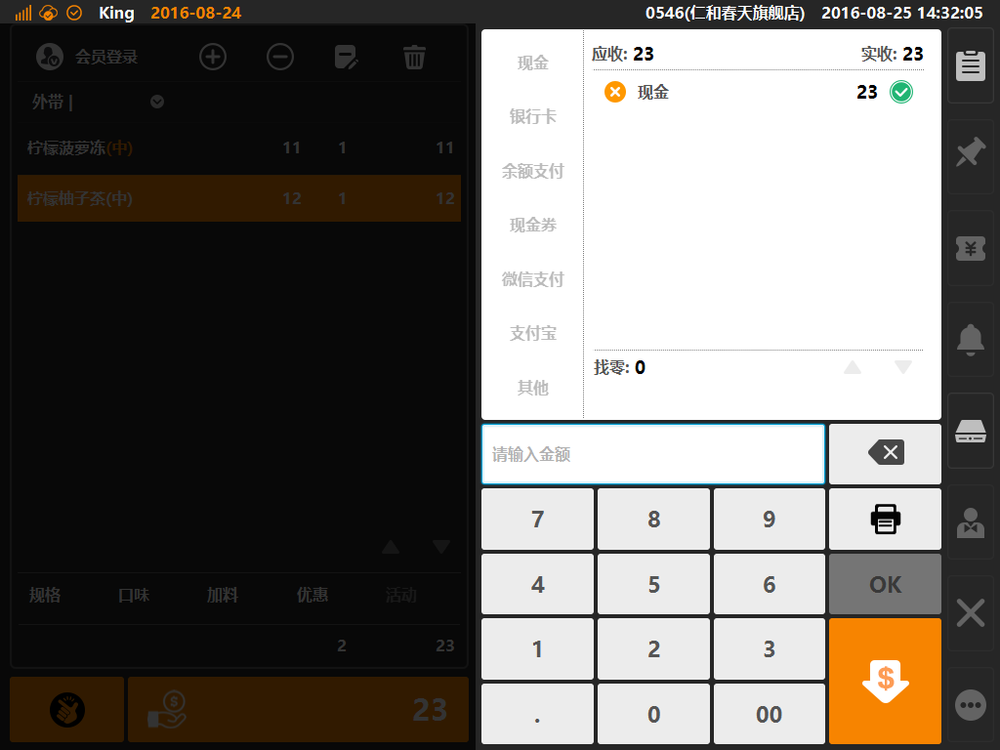
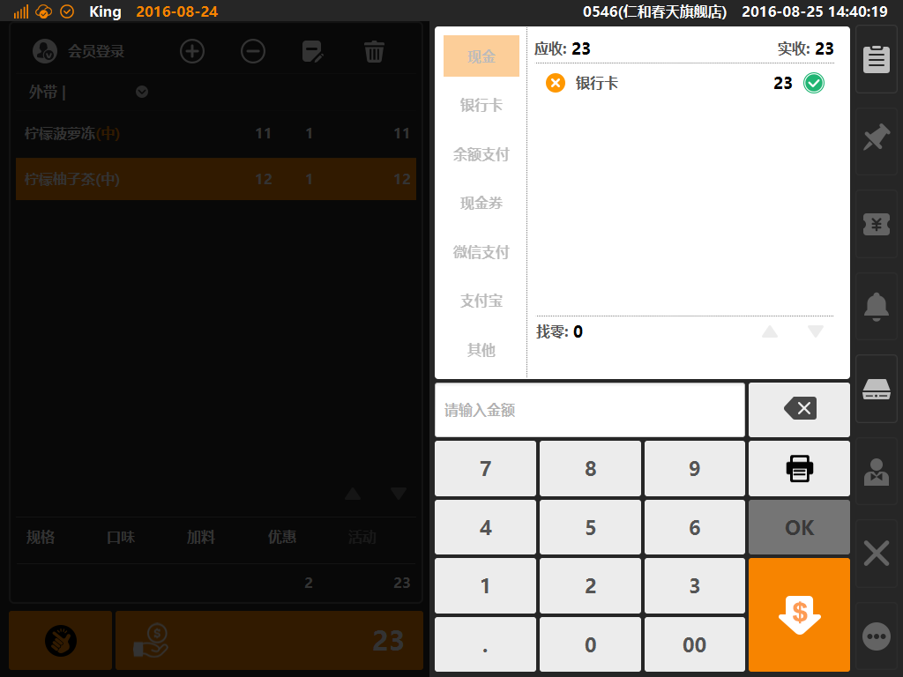
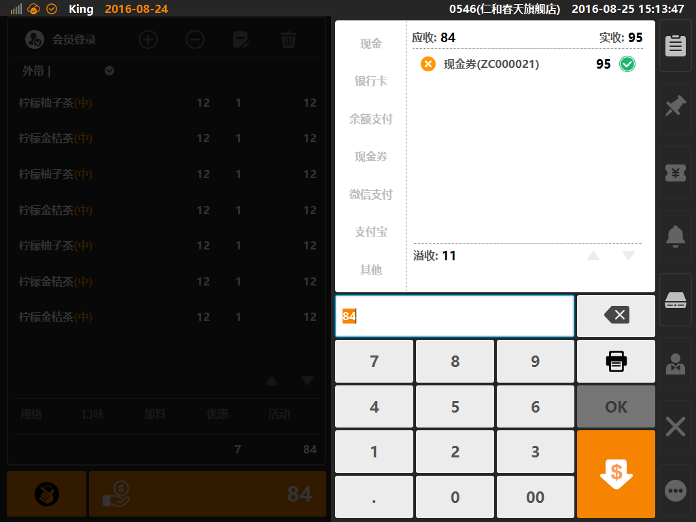
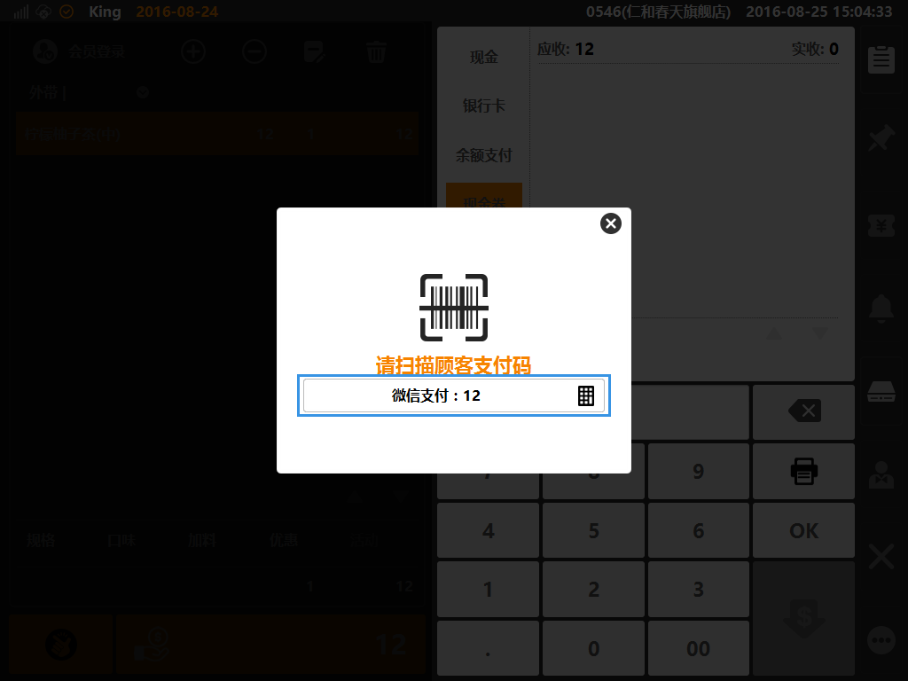
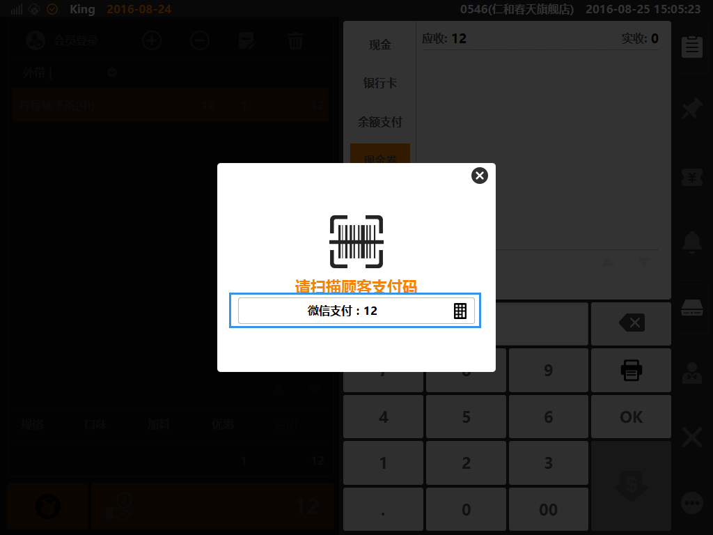
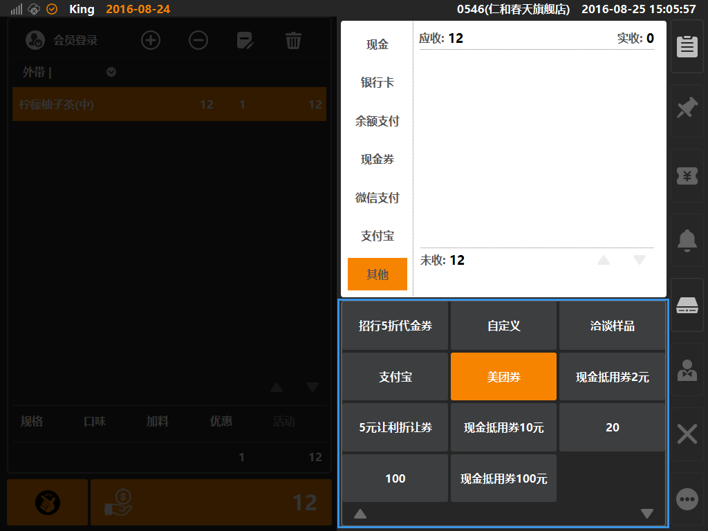

# 支付方式说明

* ## 支付方式位置  
点击一般结账按键，进入支付方式选择界面，如下图，蓝色方框内可选择支付方式，包含现金、银行卡、余额支付（可选会员余额、储值卡余额）、现金券、微信支付、支付宝、其他支付等；  

   

* ## 现金
  * 现金：适用与现金支付场景（可配置多币种支付，需要在后台位置的[系统]分类下[汇率]创建币种转化汇率）；  
  

> * 图为使用现金全额支付；  

* ## 银行卡  
  * 银行卡：作为记账识别的支付方式（不连接POS终端），一般用于银联、信用卡等支付方式；  

  
> * 图为使用银行卡全额支付；  

* ## 余额支付  
 * 余额支付：适用于电子会员储值、实体卡储值的余额支付方式场景；  

* ## 现金券
* 现金券：适用于客人适用商家发放或出售的现金抵用券等支付场景（现金券需要在后台创建并出售，在支付时需要联网校验核销）；  

> * 图为使用现金券支付，并成功核销加入支付列表；  
> * 图例为使用面值等于95元的现金券（券号：ZC000021），用于支付总金额84元的单据，由于现金券配置为不找零，所以界面上溢收11元；

* ## 微信支付  
 * 微信支付：适用于使用微信支付的客人，允许商家使用“扫码枪”扫描客人支付码进行扣款的支付场景（后台配置位置，在[服务]分类下的[微信支付]下创建）；  

> * 图为点击微信支付时的弹出界面，默认以全单金额进行收款，收银员可直接使用“扫码枪”扫描客人手机应用程序出示的支付码（支持手动变更收款金额，方法为点击上图标示位置的小键盘图标）；  

* ## 支付宝  
 * 支付宝：适用于使用支付宝支付的客人，允许商家适用“扫码枪”扫描客人支付吗进行扣款的支付场景（后台配置位置，在[服务]分类下的[支付宝支付]下创建）；  

  
> * 图为点击支付宝时的弹出界面，默认以全单金额进行收款，收银员可直接使用“扫码枪”扫描客人手机应用程序出示的支付码（支持手动变更收款金额，方法为点击上图标示位置的小键盘图标）；  

* ## 其他  
 * 其他支付：适用于不属于系统已有的支付方式，商家在后台自定义创建支付名，商家自建的支付方式统一归属于其他类别下；  

  
> * 如图所示商家创建了部分自发放的代金券，也有代表团购平台的支付方式（可用于商家线上发布团购方案，客人到店消费后，使用系统进行记账）；
