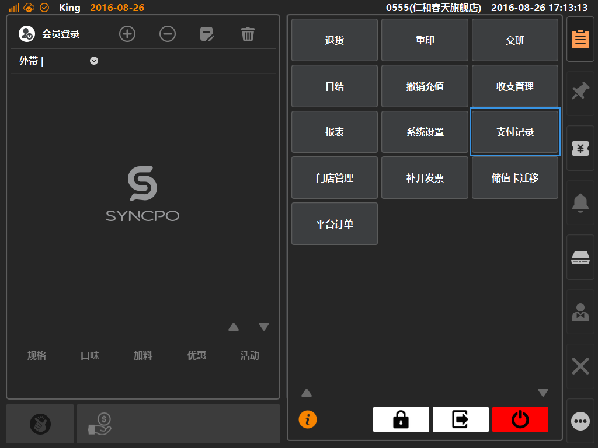
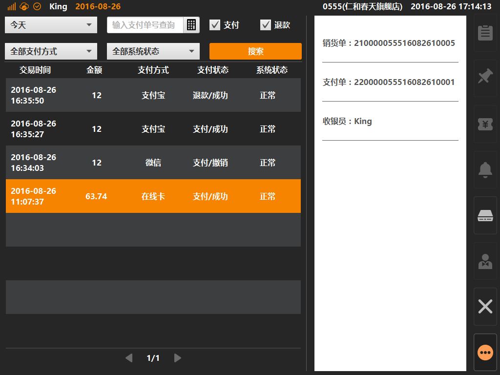

# 支付记录  
> * 支付记录：可在该界面内查看本机所有在线类支付单据的支付记录；
> * 在线类单据：需要进行网络验证类的支付统称为在线类支付，包括：储值卡、会员余额、现金券、微信钱包、支付宝；
> * 可在支付记录内进行查询、更新支付记录等操作；

* ## 操作说明
* 1.点击主功能按键区的[更多功能]按键内的[支付记录]，将进入支付记录界面；  

  

* 2.初始进入支付界面内，默认展示本机当天的所有在线类支付记录，可点击选中支付条目，查看单号及收银操作员； 
> * 支付记录主要用途是作为记录备查，当商户或客人对支付信息存在疑问时，可在记录内获取信息核对，也可以对因网络延迟等问题的支付信息进行数据更新； 

 > * 一般情况下，只要支付记录内的[系统状态]栏位显示为“正常”，便说明该笔支付为正常交易；
 > * 如果[系统状态]内显示为“异常”，大部分情况下，点击该支付记录，在点击[更新]按键，获取最新状态后数据可恢复正常状态；

  

  
  

