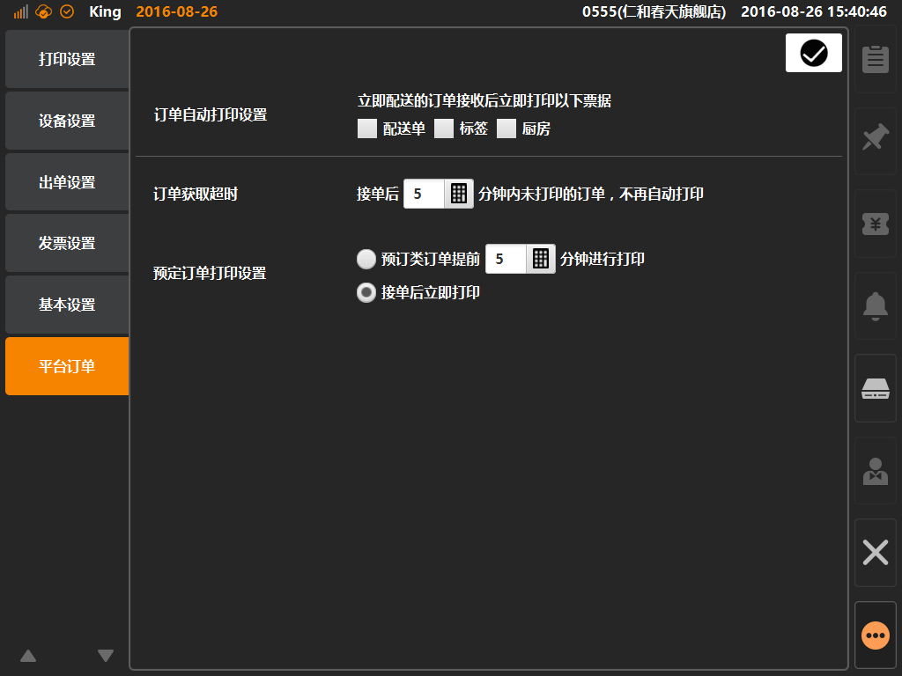

# 支付记录  
> * 支付记录：可在该界面内查看本机所有在线类支付单据的支付记录；
> * 在线类单据：需要进行网络验证类的支付统称为在线类支付，包括：储值卡、会员余额、现金券、微信钱包、支付宝；
> 

* ## 操作说明
* 1.点击主功能按键区的[更多功能]按键内的[系统设置]，将进入系统设置界面；  

  

* 2.系统设置界面内，点击选中[平台订单]，可查看并编辑接单打印配置；   
 

  

  
  

