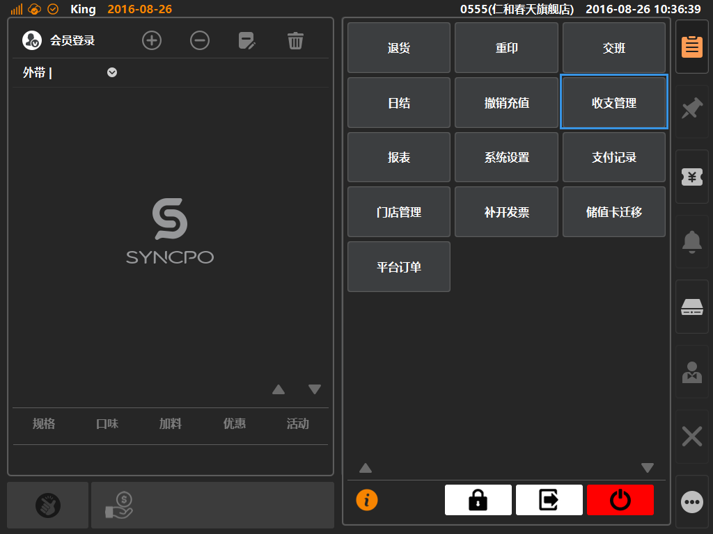
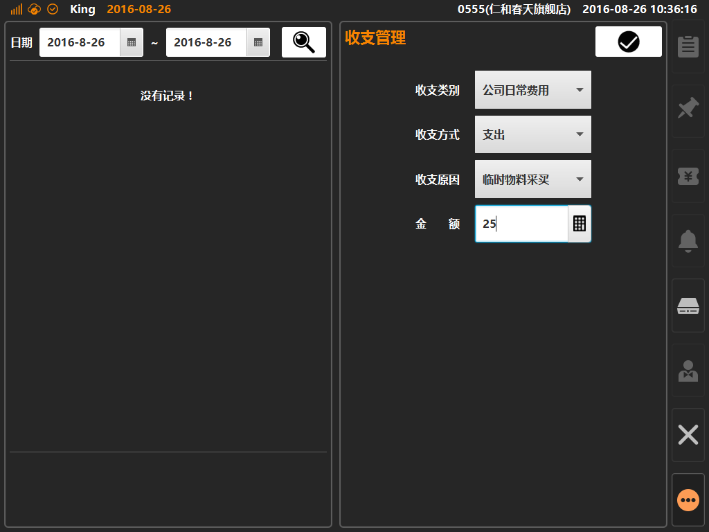
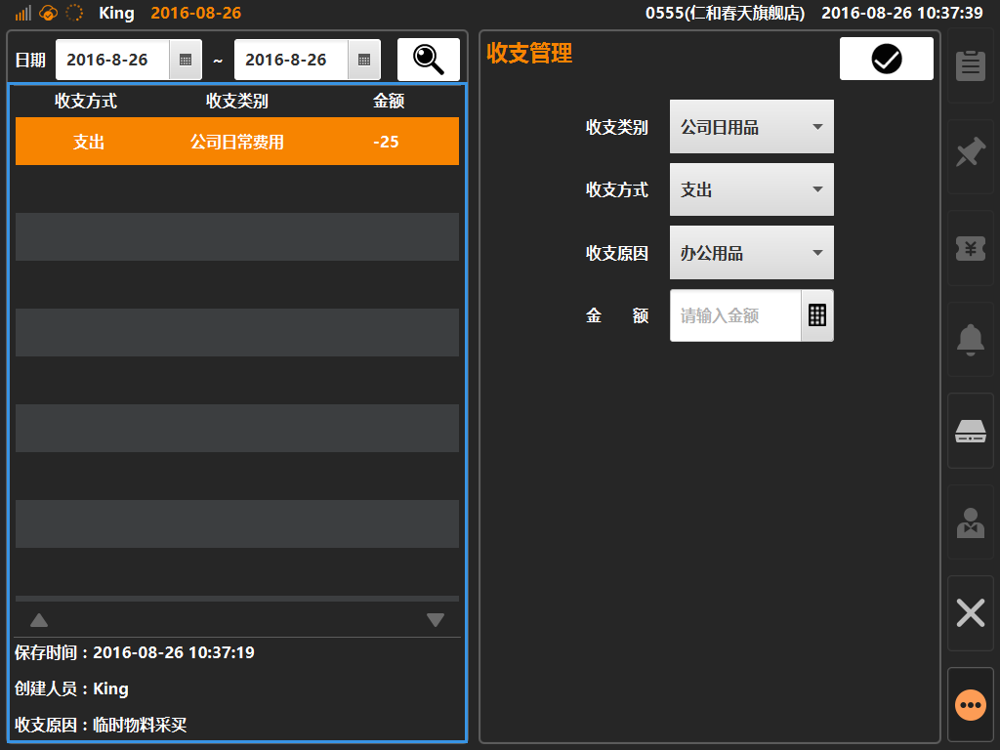

# 收支管理  
> * 收支管理是什么：部分无法直接使用Sync系统进行交易操作，属于门店运营时产生的额外钱款交易（如水电费、设备维修费），Sync系统提供收支管理来进行记账处理；  
> * 经由收支管理记录的费用统一记账为[现金]交易，并统计入报表；

* ## 操作说明
* 1.点击主功能按键区的[更多功能]按键内的[收支管理]，将展示进入收支管理界面；  

  

* 2.收支管理界面内，右侧可根据需求选择收支类别、方式、原因，最后输入收支金额，点击确认后将保存下收支账目；  

  

* 3.收支管理界面内，左侧为已保存成功的收支明细，点击可查看创建时间、创建人等信息；  

  
  

