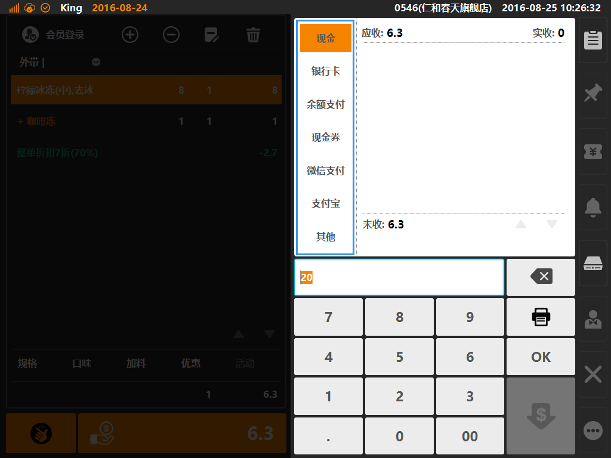

# 收银流程说明

> * 点单业务的流程一般以收银作为结束动作；
> * 点单业务：包括售卖一般商品、实体卡、充值、现金券等；  

* ## 收银入口  
收银入口按键为购物车下方，当购物车内存在已生效的商品时，下方收银按键橙色高亮，且为可点击状态，如下图；  

  
> * 收银按键：两个收银按键，皆可完成收银动作；  
> * 左侧收银按键为快速结账按键，点击后默认以现金进行结账，且收现金额等同单据金额；  
> * 右侧收银按键为一般结账按键，点击可进入结账方式选择界面；  

* ## 结账方式选择  
点击一般结账按键，进入支付方式选择界面，如下图，可在该界面选择客人使用的支付方式，查看支付明细、应收、实收、找零、溢收等信息；  
  
> * 如图，蓝色方框内可选择支付方式，包含现金、银行卡、余额支付（可选会员余额、储值卡余额）、现金券、微信支付、支付宝、其他支付等；  
> * 现金：适用与现金支付场景（可配置多币种支付，需要在后台位置的[系统]分类下[汇率]创建币种转化汇率）；
> * 银行卡：作为记账识别的支付方式（无需连接POS终端），一般用于银联、信用卡等支付方式；  
> * 余额支付：适用于电子会员储值、实体卡储值的余额支付方式场景；
> * 现金券：适用于客人适用商家发放或出售的现金抵用券等支付场景（现金券需要在后台创建并出售，在支付时需要联网校验核销）；
> * 微信支付：适用于适用微信支付的客人，允许商家适用“扫码枪”扫描客人支付码进行扣款的支付场景；