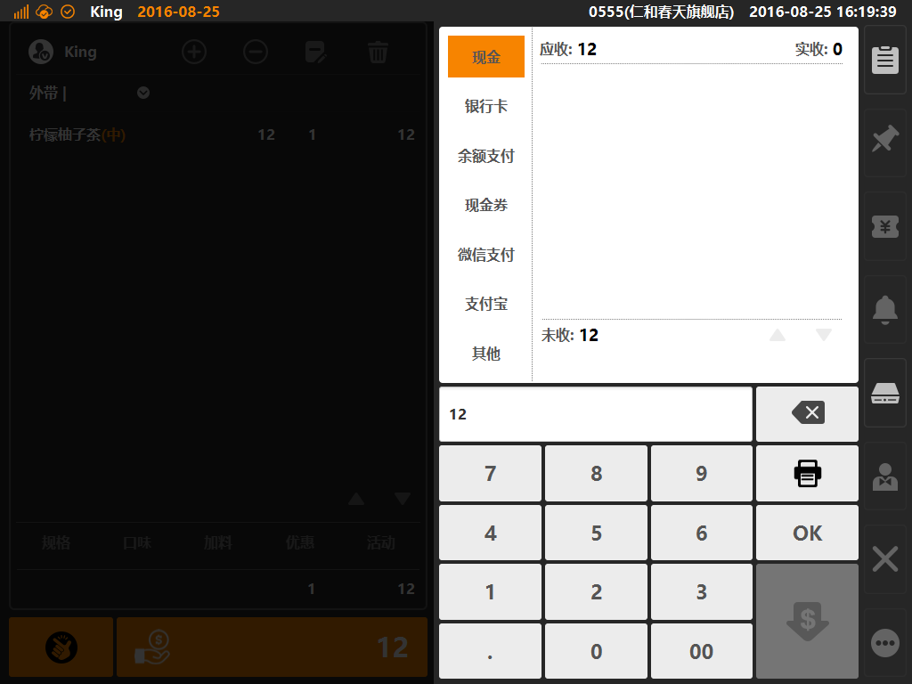

# 收银流程说明

> * 点单业务的流程一般以收银作为结束动作；
> * 点单业务：包括售卖一般商品、实体卡、充值、现金券等；  

* ## 收银入口  
收银入口按键为购物车下方，当购物车内存在已生效的商品时，下方收银按键橙色高亮，则为可点击状态，如下图；  

  
> * 收银按键：两个收银按键，皆可完成收银动作；  
> * 左侧收银按键为快速结账按键，点击后默认以现金进行结账，且收现金额等同单据金额；  
> * 右侧收银按键为一般结账按键，点击可进入结账方式选择界面；  

* ## 结账界面  
* 点击结账按键，进入支付方式选择界面，如下图，可在该界面选择客人使用的支付方式，同时可查看支付明细、应收、实收、找零、溢收等信息；  
* 键盘区域为支付金额输入，通过小键盘输入客人支付金额（默认将未收金额写入输入栏）；
    

* ## 收款信息  
* 根据收银员的收款动作，结账界面将展示每一次收银操作，并将信息展示在界面上，如图；  
* 图示为两次收款动作，一次现金收款5元，一次银行卡收款5元，单据总价12元，余下2元未收，10元为实收；  

