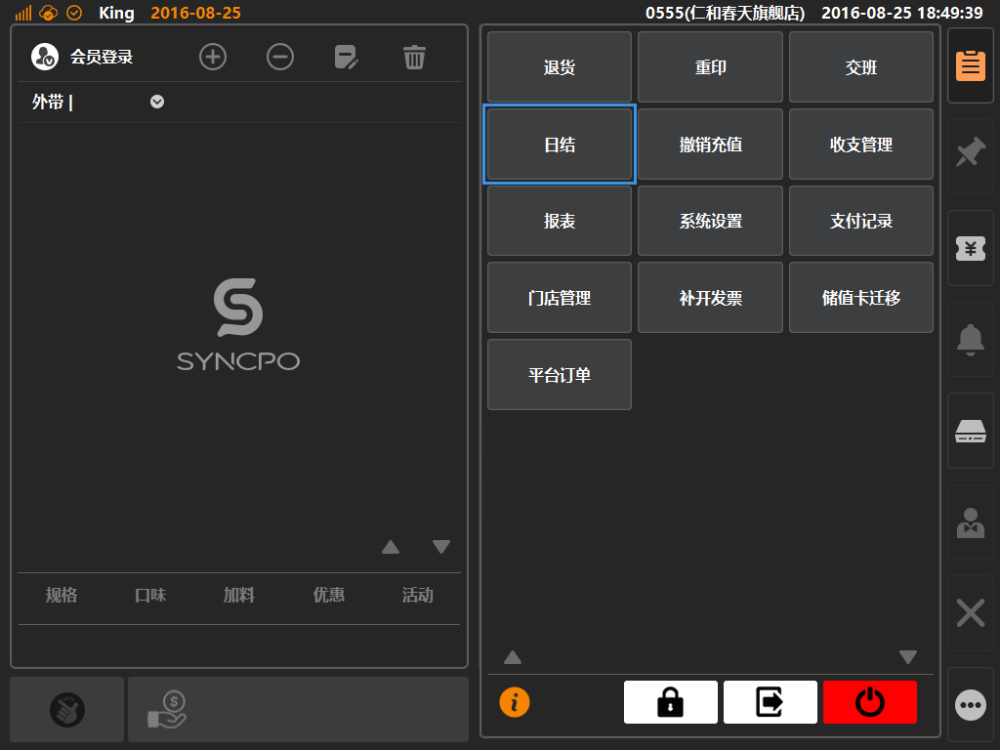
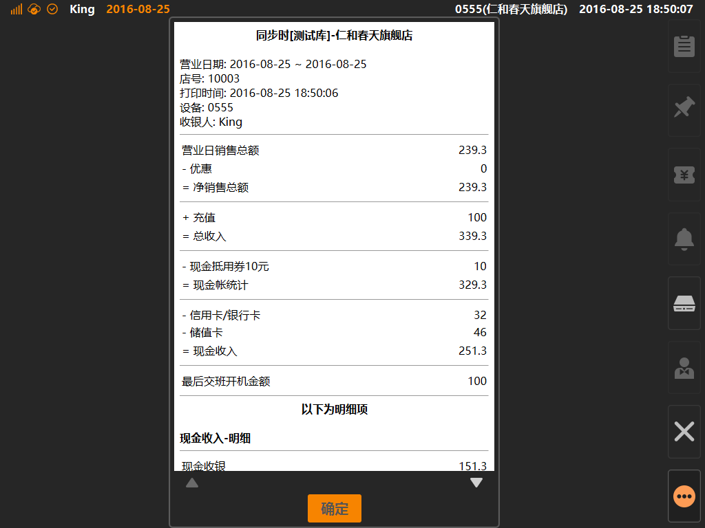
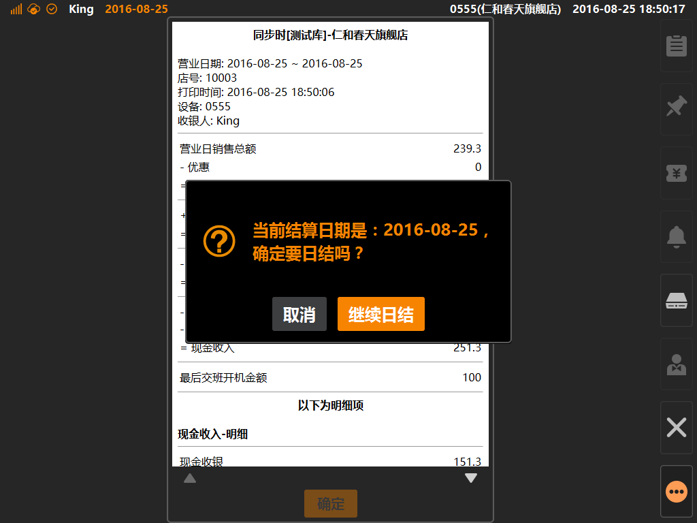

# 日结  
> 日结是什么：门店打烊，结束当前营业日，并将营业日产生的收支进行账务归属；  

* ## 操作说明
* 1.点击主功能按键区的[更多功能]按键内的[日结]，将展示日营业报表；  

  

* 2.点击[日结]将展示日营业报表信息，供收银员进行数据核对；  

  

* 3.点击[确认]按键，将弹窗二次进行确认，点击[继续日结]，可完成日结操作；  

  
> * 日结完成后，表示营业日完结，无法在当前登录状态下进行收银、充值、退货等设计金额交易的操作；  
> * 需要退出登录状态后，在登录时再次进行开账；

