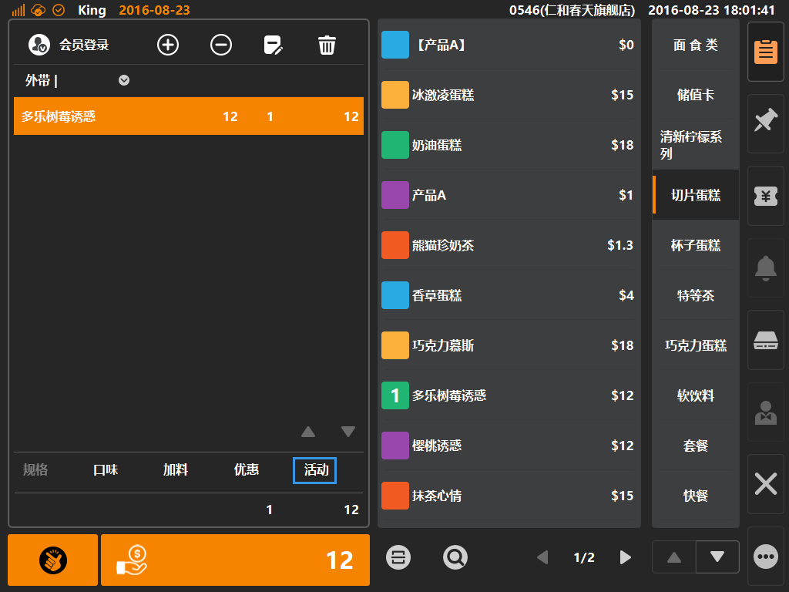
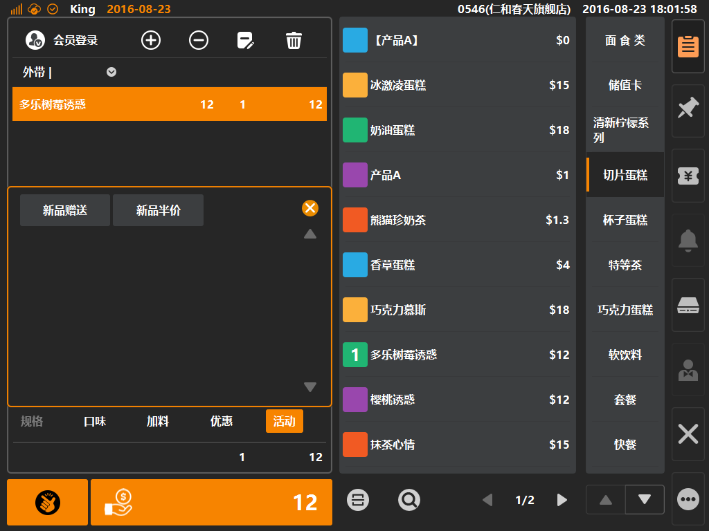

# 活动  

* ## 商品活动  
> * 活动是什么：活动是基于条件的优惠方式，条件包括:**活动时间、活动对象（会员/非会员）、基于某个指定商品、基于整单金额**等等；
> * 活动需要配置前置条件，基于条件判断是否执行活动；  
> * 活动的执行可拥有不同的效果，包括：**指定售价、执行折扣、执行让价、**选择赠送商品（赠品同样可执行前三种效果）
> * 活动在后台创建，登录后台后，在[销售]分类下的[行销活动]内创建；

 
* 选中购物车中商品，如该商品拥有活动，则购物车底部活动字体由置灰变可点击状态，如下图；  
  
  
  
>  * 如果当前商品只拥有一个活动，则活动自动加入购物车；
>  * 如果商品拥有一个以上的活动，则不自动加入购物车，需要收银员手动选择，而商品条目将显示一个绿色角标，表示该商品有活动可选择；       
  
   
* 点选[活动]则可弹出活动弹窗，通过点击活动名称按键来选择活动；  

  
>  * 活动移除操作，选中购物车中绿色的活动条目，之后点击购物车上方[垃圾桶]图标，可以移除该活动；  
>         
    

