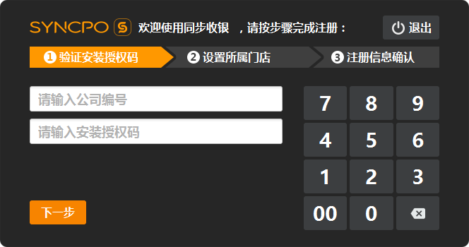
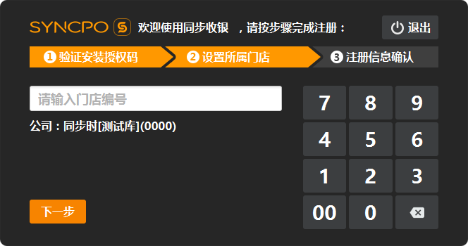
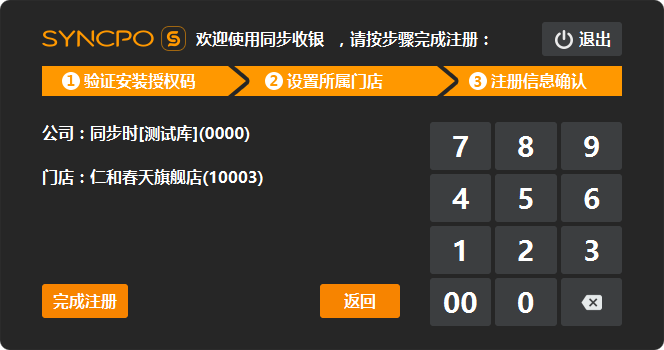

# 激活产品

##激活说明  
第一步：**[验证安装授权码]**  
程序安装完成后首次启动，将进入激活注册界面，输入公司编号及安装授权码后，点击下一步，将发起云服务器验证（需要联网验证），验证通过方可进入第二步；  
  
> 公司编号与安装授权码，可从后台获取；  
> 在登陆后台后，进入**[系统]**功能内的**[公司资讯]**中查看；  

第二步：**[设置所属门店]**  
为程序选择归属门店，输入正确的门店编号，点击下一步，将发起云服务验证（需要联网验证），验证通过后方可进入第三步；  
  
> 门店编号，可从后台获取；  
> 在登陆后台后，进入**[门店]**功能内的**[门店资讯]**中查看；  

第三步：展示注册信息，确认无误可点击**[完成注册]**，可也点击**[返回]**，可返回**[设置所属门店]**；  
  
> 完成注册后，将自动启动程序；

