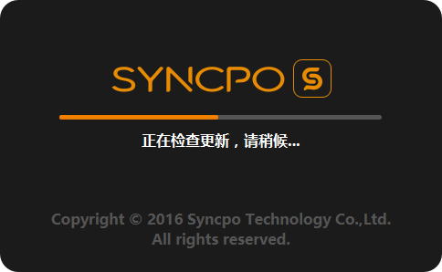

# 程序启动  

* ## 启动过度界面
  
> 系统在启动时，将从服务器上主动获取最新数据，如有数据更新（如商品变更品名、售价、软件版本更新等）将在启动时获取更新文件，进入系统后将展示最新的数据；  
> * 程序版本的更新也依赖于启动时进行版本升级；  
> * 如在系统运行期间更新并下派了后台数据，请退出程序重启，并保持有效的网络连接，程序将在二次启动的过程内下载并更新最新数据；
> * PS：启动程序时请尽量保持网络连接；

