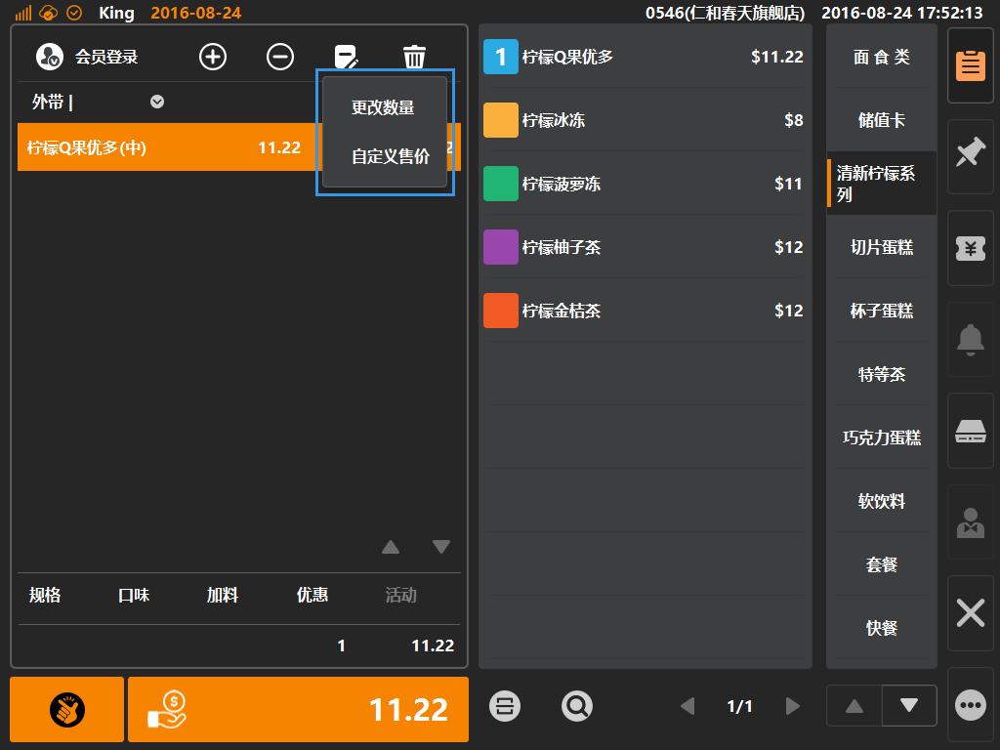
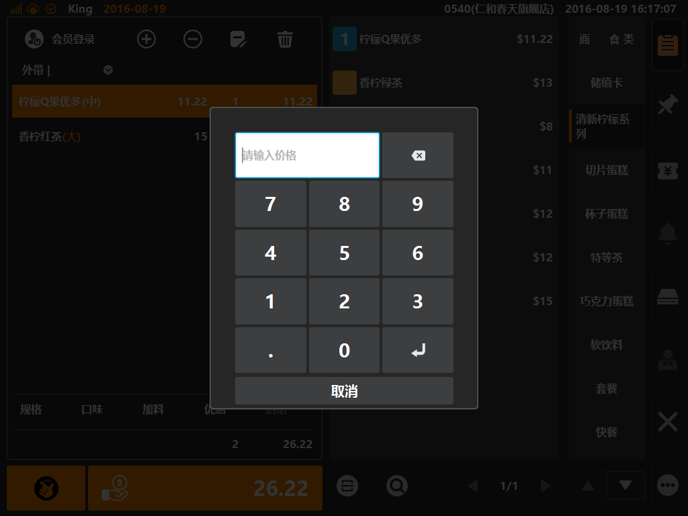

# 编辑按键  
* ## 按键位置  
当购物车内存在商品，且选中状态下，编辑按键高亮，点击将出现下拉选项，可选编辑数量或者编辑单价；  

> * [更改数量]默认所有商品都可以编辑；  
> * [自定义售价]需要后台对该商品进行是否允许修改单价配置，后台配置位置在[商品]分类下的[商品资讯]，点击商品条目查看详情，在详情业内的[修改单价]进行配置（默认不允许修改单价）；

* ## 编辑数量/售价弹窗  
选择编辑数量或者售价后，将弹出弹窗修改界面，通过点击小键盘，输入要编辑的商品数量/商品售价，最后点击虚拟键盘的[回车]按键来确认该次操作；  

  
> [数量编辑]与[售价编辑]的输入界面相同，只是输入框内提示语为“请输入商品数量”与“请输入价格”；