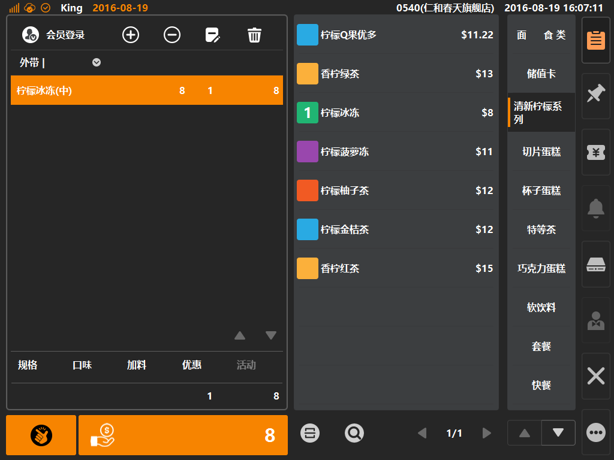

# 菜单点单  

* ## 第一步：点选中类，点击商品加入购物车  
* 通过点选中类，来快速定位商品，点击商品可加入购物车；   

>    * 将商品中类与商品按照一定的顺序排序，有助于快速定位点单；
>    * 商品顺序配置：登陆后台，在[商品]分类下的[商品资讯]内，点击具体商品，在属性界面内的[显示顺序]填写排序号，序号越小则排位越优先；  
>    * 商品中类顺序配置：登陆后台，在[商品]分类下的[商品中类]内，点击具体中类，在属性界面内的[显示顺序]填写排序号，序号越小则排位越优先；  