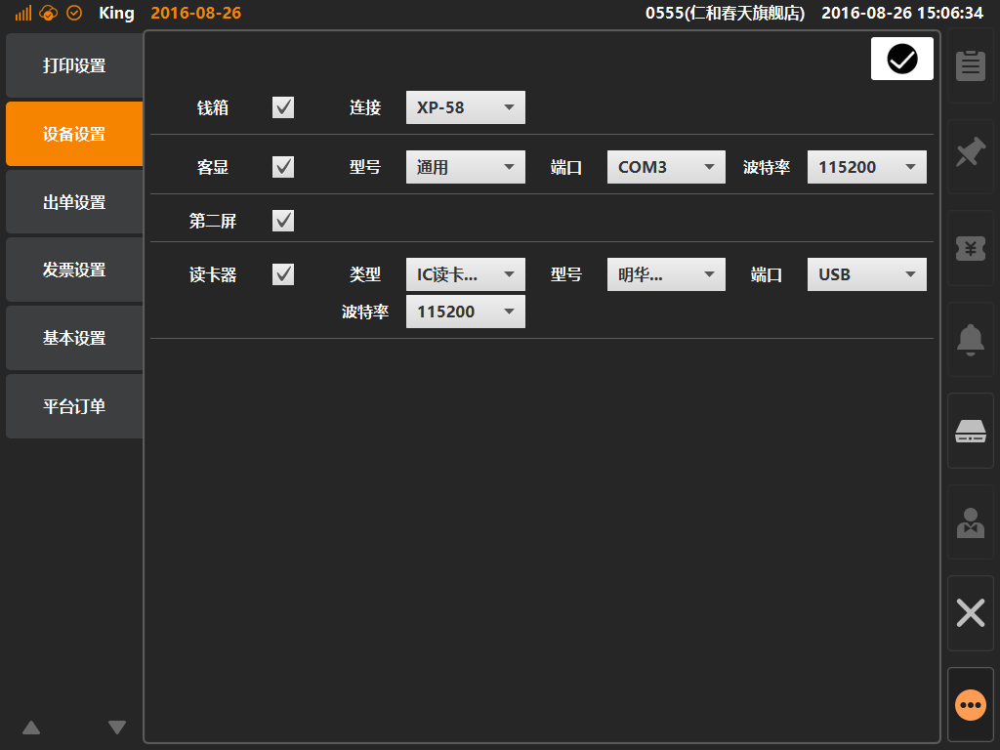

# 设备设置  
> * 设备设置：为四种外部设备进行参数配置，包括钱箱、客显、第二屏、读卡器；  

* ## 操作说明
* 1.点击主功能按键区的[更多功能]按键内的[系统设置]，在进入系统设置界面后，点击[设备设置]；  

  

* 2.设备设置界面内，每个外接设备需要勾选才能被启用，需根据实际情况选择外接设备参数；   
* 钱箱：钱箱直连打印机的情况下，连接选项选择打印机型号；
* 客显：需要选择正确的端口，型号与波特率一般情况下无需配置；
* 第二屏：勾选保存即启用；
* 读卡器：需要选额设备类型，分为IC读卡与条码刷卡设备，如设备为IC读卡类型，还需要根据设备选择波特率、型号与端口；
 

  

  
  

