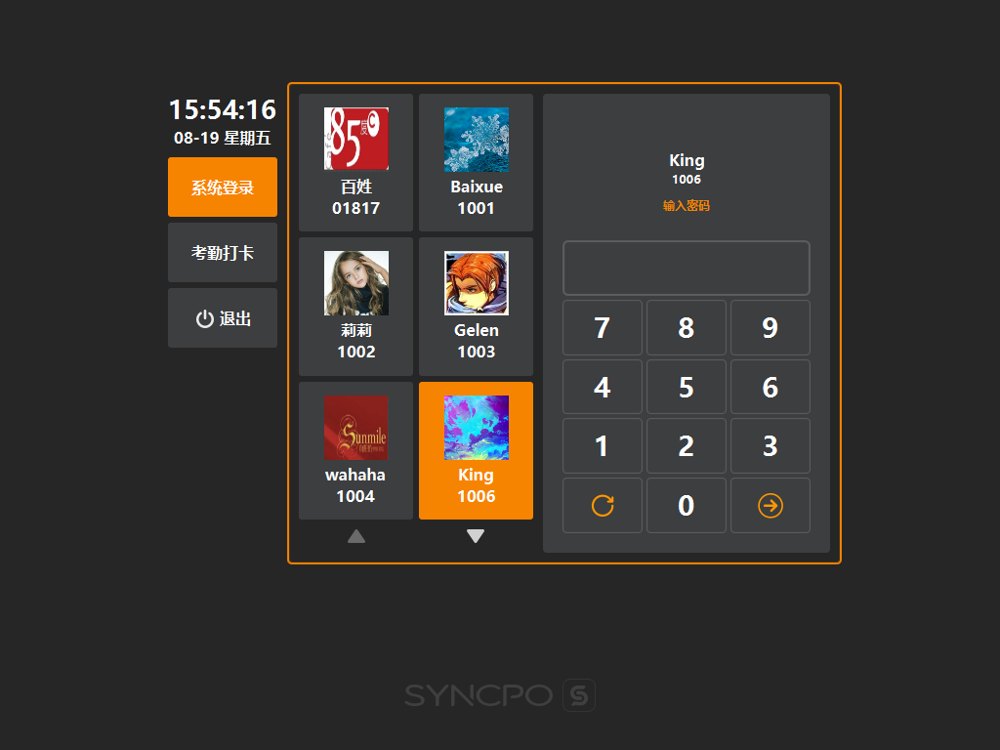
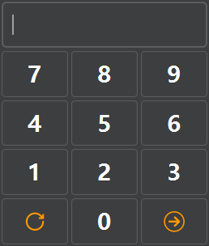

# 账号登录  

* ## 登录  

> 默认界面，默认选中[系统登录]  

* ## 选择登录账号  
   
> 点击可选中要登录的账号，同时可使用上下翻页箭头查找非当前页账号；  
> 账号与密码的配置可在后台的[系统]分类下的[POS使用者]及[POS角色]进行配置；  

* ## 输入密码  
  

* ## 登录  
  
> 输入密码后，点击上图图标可登录系统；

 

