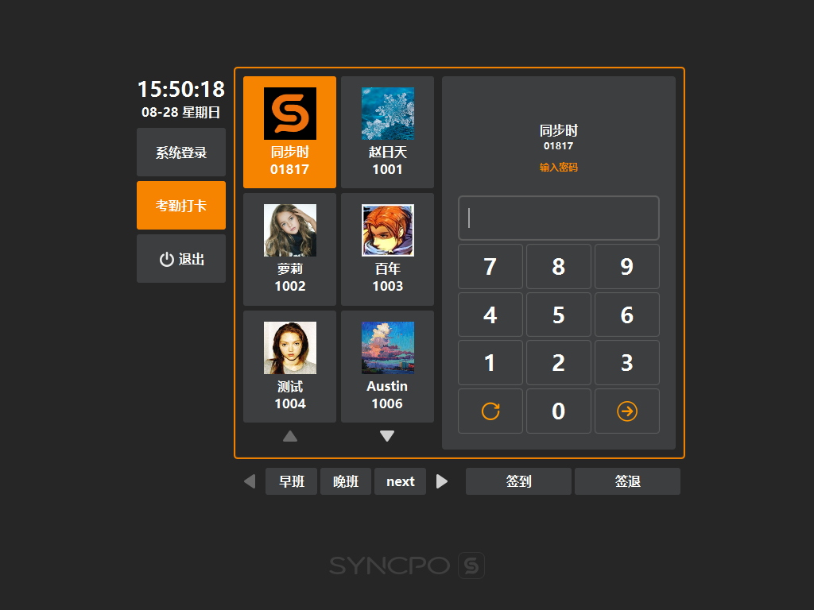

# 账号考勤  

* ## 考勤  
  
> 选择[考勤打卡]，将出现班次及签到签退按键；
>   

* ## 选择考勤账号
选择要考勤的账号，并输入密码；  

* ## 选择班次  
选择要考勤的班次；  
> 需要在后台创建班次，并下派数据到门店；  
> 后台创建位置：在[系统]分类下的[班次设置]内创建；  

* ## 签到/签退  
根据实际情况，选择上班签到，或者下班签退；  
> 考勤明细可在后台进行查询，具体位置在后台的[报表]分类下，[员工考勤表]；