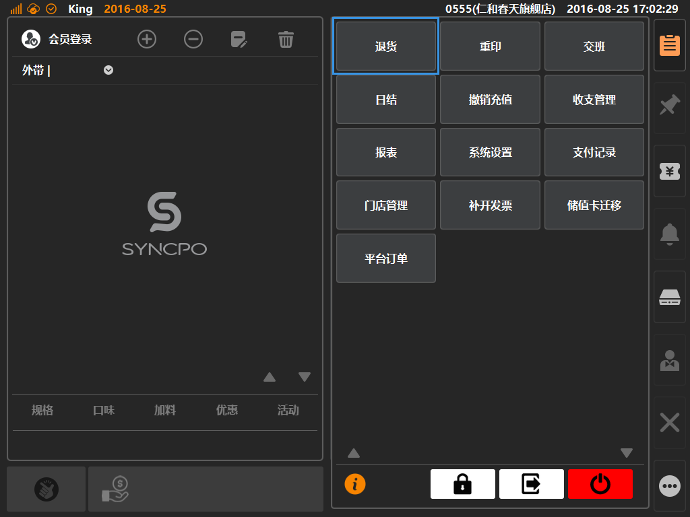
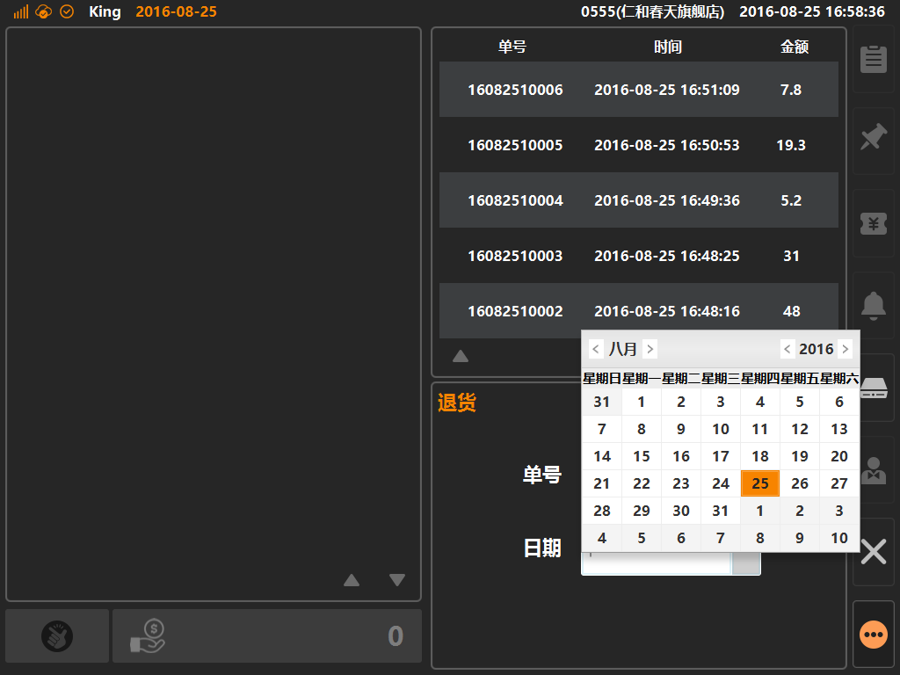
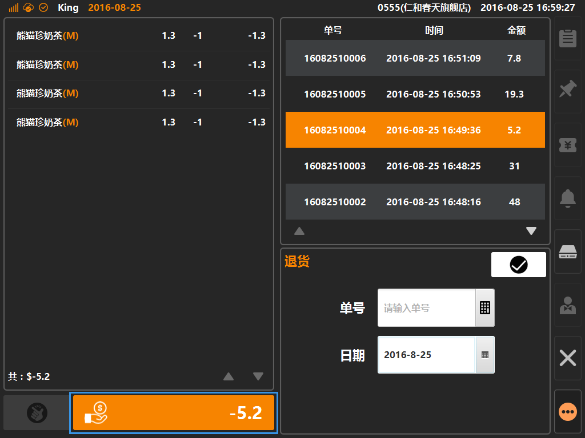
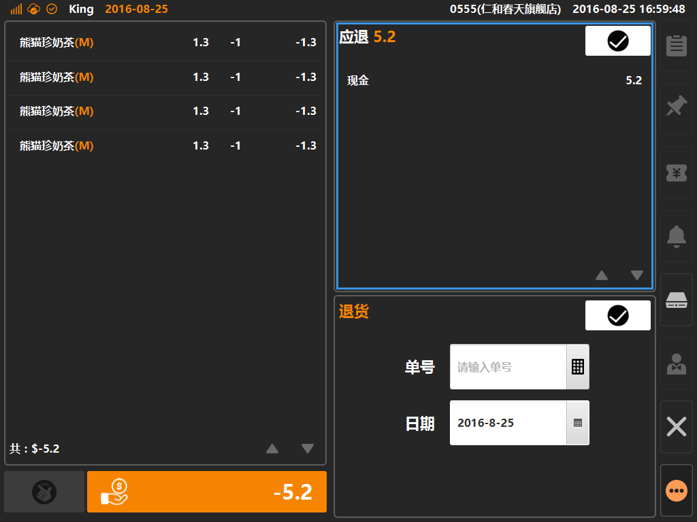

# 退货  
* ## 操作说明  
* 1.点击主功能按键下的[退货]，将进入如下界面，可在该界面内进行退货操作；  

  

* 2.搜索单据：可根据日期与单号进行单据筛选；

  

* 3.选择要退货的单据信息，左侧将展示具体的商品详情及单据金额，通过点击退款按键，进入退款流程，如图蓝色方框内；

* 4.可在该页面查看单据的支付信息详情，确认无误可点击右上角[确认]按键，执行退货操作；  

  
> * 退货操作内如果涉及在线类支付将自动由系统发起退款操作；  
> * 在线类支付明细：微信支付、支付宝支付、电子会员余额、在线储值卡余额、现金券支付；  
> * 当执行退货的单据内包含有不允许退货的支付方式时，退货操作将被系统阻止，无法完成退货流程；
> * 任何支付方式都可在后台进行允不允许退货的配置，具体位置在后台的[系统]分类下的[收款按键]内进行设定；
