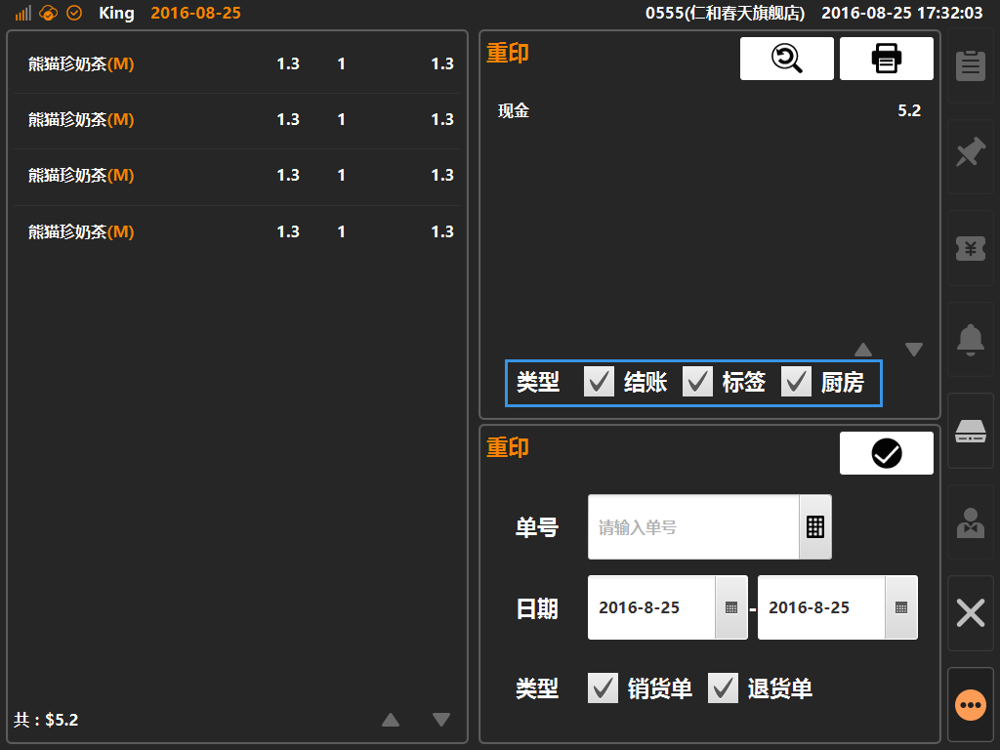

# 重印  
> * 重印：对已结账的单据进行二次打印操作；  

* ## 操作说明  
* 1.点击主功能按键的[更多功能]按键内的[重印]，可进入重印操作界面；  

  

* 2.进入重印界面，可通过查询条件找到需要重印的单据；
* 查询条件：单号、日期范围、销货/退货类型；  

* 3.选择要重印的单据，可进入单据详情界面，同时可选择需要重印的票据类型；  
* 票据类型：根据打印机配置情况展示可进行打印的票据类型，如下图则配置了结账、标签、厨房三种类型票据；  
* 默认勾选所有票据类型，选择完成后通过点击右上角打印机图标触发打印动作；

